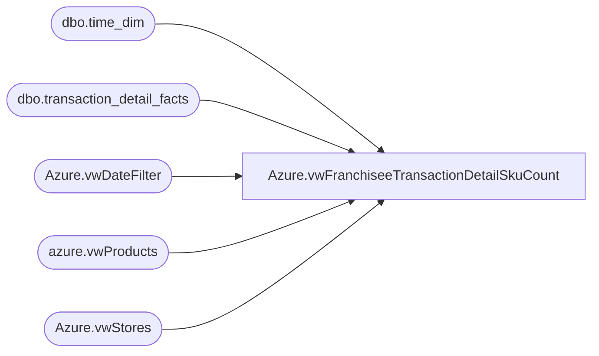

# Azure.vwFranchiseeTransactionDetailSkuCount

**Database:** dw  
**Server:** papamart  

## Architecture Diagram



## Table Dependencies

| Referenced Table |
|---|
| dbo.time_dim |
| dbo.transaction_detail_facts |
| Azure.vwDateFilter |
| azure.vwProducts |
| Azure.vwStores |

## View Code

```sql
CREATE VIEW [Azure].[vwFranchiseeTransactionDetailSkuCount]

AS
-- =============================================================================================================
-- Name: [Azure].[vwTransactionDetailskucOUNT]
--
-- Description: Finds transactions with only a single unstuffed sku.  
--
--
-- Dependencies: Stores, date filter view and product dim
--
-- Revision History
--		Name:				Date:			Comments:
--		JOhn Eck			8/9/2018		Initial creation
--
-- =============================================================================================================


SELECT Cast(transaction_id as Varchar(20)) + cast(ds.StoreKey as Varchar(10)) as TransactionKey 
      ,count(Distinct(Product_Key)) as AnimalCount

  FROM  dbo.transaction_detail_facts tdf 
	LEFT OUTER JOIN [dbo].[time_dim] td
		ON td.time_key = tdf.time_key 
	Inner JOIN Azure.vwDateFilter dd
		ON tdf.date_key = dd.date_key  
	INNER JOIN
          Azure.vwStores AS ds ON ds.StoreKey = CONVERT(VARCHAR, tdf.store_key)
	inner join azure.vwProducts P on tdf.product_Key = p.ProductKey
where department = 'Unstuffed' and tdf.Product_Key>=0
Group By Cast(transaction_id as Varchar(20)) + cast(ds.StoreKey as Varchar(10)) 
Having count(Distinct(Product_Key)) = 1
```

