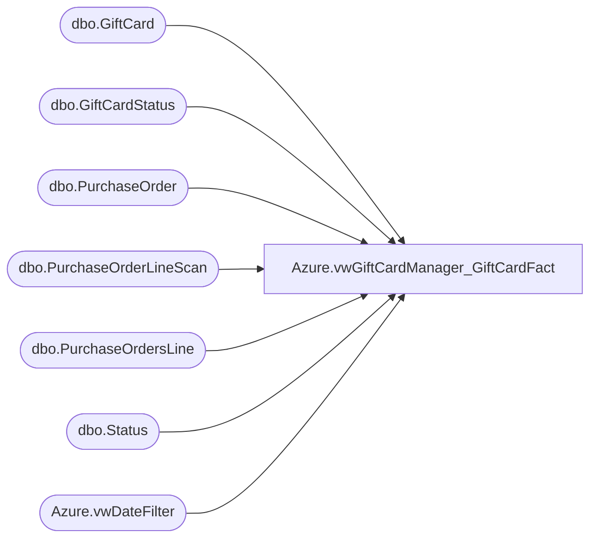

# Azure.vwGiftCardManager_GiftCardFact

**Database:** dw  
**Server:** papamart  

## Architecture Diagram



## Table Dependencies

| Referenced Table |
|---|
| dbo.GiftCard |
| dbo.GiftCardStatus |
| dbo.PurchaseOrder |
| dbo.PurchaseOrderLineScan |
| dbo.PurchaseOrdersLine |
| dbo.Status |
| Azure.vwDateFilter |

## View Code

```sql
CREATE VIEW [Azure].[vwGiftCardManager_GiftCardFact]
-- =============================================================================================================
-- Name: vwGiftCardManager_GiftCardFact
--
-- Description:	Returns Gift Card Fact data for DOMO reporting
--	
-- Output: Gift Card Fact Data
--	
-- Available actions:
--	
-- Dependencies: 
-- Revision History
--		Name:			Date:			Comments:
--		John Eck		9/20/18			Initial Creation
-- =============================================================================================================
AS

WITH GiftCardActivationDates ([GiftCardID]
	                         ,[CRTED_DT])
AS
(
  SELECT [GiftCardID]
	    ,CAST(gcs.[CRTED_DT] AS DATE)
  FROM [Kodiak].[GiftCardMstrData].[dbo].[GiftCardStatus] gcs
  LEFT JOIN [Kodiak].[GiftCardMstrData].[dbo].[Status] s ON gcs.StatusID = s.StatusID
  WHERE s.StatusDescription = 'GiftCard Activated'
),
     GiftCardVoidDates ([GiftCardID]
	                   ,[CRTED_DT])
AS
(
  SELECT [GiftCardID]
	    ,CAST(gcs.[CRTED_DT] AS DATE)
  FROM [Kodiak].[GiftCardMstrData].[dbo].[GiftCardStatus] gcs
  LEFT JOIN [Kodiak].[GiftCardMstrData].[dbo].[Status] s ON gcs.StatusID = s.StatusID
  WHERE s.StatusDescription = 'GiftCard Voided'
)
SELECT gc.[GiftCardID]
      ,[GiftCardNumber]
	  ,[PurchaseOrderNumber]
	  ,CAST([PurchaseOrderDateTime] AS DATE) AS 'PurchaseOrderDateTime'
	  ,[DeliveryLocationID] AS 'LocationID'
	  ,[RequestedDeliveryDate]
	  ,CAST([ShipDateTime] AS DATE) AS 'ShipDateTime'
	  ,[ShipperTrackingNumber]
	  ,[InvoiceNumber]
	  ,gcad.CRTED_DT AS 'ActivationDate'
	  ,gcvd.CRTED_DT AS 'DeactivationDate'
FROM [Kodiak].[GiftCardMstrData].[dbo].[GiftCard] gc
LEFT JOIN GiftCardActivationDates gcad ON gc.GiftCardID = gcad.GiftCardID
LEFT JOIN GiftCardVoidDates gcvd ON gc.GiftCardID = gcvd.GiftCardID
LEFT JOIN [Kodiak].[GiftCardMstrData].[dbo].[PurchaseOrderLineScan] pols ON gc.PurchaseOrderLineScanID = pols.PurchaseOrderLineScanID
LEFT JOIN [Kodiak].[GiftCardMstrData].[dbo].[PurchaseOrdersLine] pol ON pols.PurchaseOrderLineID = pol.PurchaseOrderLineID
LEFT JOIN [Kodiak].[GiftCardMstrData].[dbo].[PurchaseOrder] po ON pol.PurchaseOrderID  = po.PurchaseOrderID
join Azure.vwDateFilter df on cast(gcad.CRTED_DT as date)=cast(df.actual_date as date)
```

