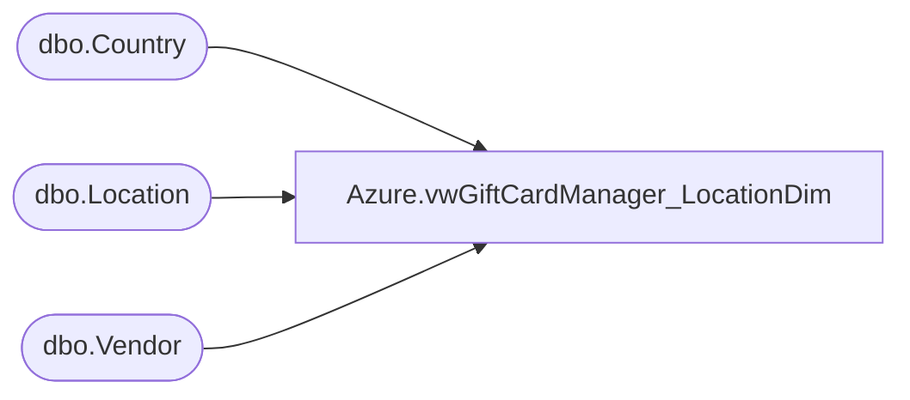

# Azure.vwGiftCardManager_LocationDim

**Database:** dw  
**Server:** papamart  

## Architecture Diagram



## Table Dependencies

| Referenced Table |
|---|
| dbo.Country |
| dbo.Location |
| dbo.Vendor |

## View Code

```sql
CREATE VIEW [Azure].[vwGiftCardManager_LocationDim]
-- =============================================================================================================
-- Name: vwGiftCardManager_LocationDim
--
-- Description:	Returns Gift Card Location Dim data for DOMO reporting
--	
-- Output: Gift Card Location Dim
--	
-- Available actions:
--	
-- Dependencies: 
-- Revision History
--		Name:			Date:			Comments:
--		Ben Barud		08/16/2016		Initial Creation
--		Ben Barud		08/23/2016		Per Bryce Ahrens, only need right 4 digits of Vendor Location Number
-- =============================================================================================================
AS
SELECT  l.LocationID, v.VendorName, l.BABWLocationCode, RIGHT(l.VendorLocationNumber, 4) 'VendorLocationNumber', l.LocationName, l.LocationAddress1, l.LocationAddress2, l.LocationCity, l.LocationState, 
        l.LocationZip, c.CountryAbbreviation, l.LocationContact, l.LocationDivision
FROM KODIAK.GiftCardMstrData.dbo.Location AS l 
LEFT OUTER JOIN KODIAK.GiftCardMstrData.dbo.Vendor AS v ON l.VendorID = v.VendorID 
LEFT OUTER JOIN KODIAK.GiftCardMstrData.dbo.Country AS c ON l.LocationCountryID = c.CountryID
```

