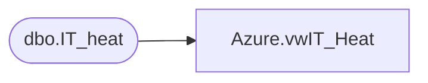

# Azure.vwIT_Heat

**Database:** dw  
**Server:** papamart  

## Architecture Diagram



## Table Dependencies

| Referenced Table |
|---|
| dbo.IT_heat |

## View Code

```sql
CREATE view [Azure].[vwIT_Heat]

AS
-- =============================================================================================================
--		Name:				Date:			Comments:
--		Ian Wallace			05/1/2022		Initial creation
-- =============================================================================================================


SELECT [ActualCategory],[AlternateContactEmail],[AlternateContactPhone],[Approver],[babw_Area],[babw_Country],[babw_CustomerType],[babw_FollowUp]
      ,[babw_IssueType],[babw_Reopen],[babw_SSMsg],[babw_WaitingForCustomerNote],[Category],[CauseCode],[ClosedBy],[ClosedDateTime],[ClosedDuration],[CreatedBy],[CreatedByType]
      ,[CreatedDateTime],[CustomerDepartment],[Email],[HoursOfOperation],[Impact],[IncidentNetworkUserName] ,[IncidentNumber],[IsReclassifiedForResolution],[LastModBy] ,[LastModDateTime]
      ,[LoginId],[OrganizationUnitID],[Owner],[OwnerEmail],[OwnershipAssignmentEmail],[OwnerTeam],[OwnerTeamEmail],[OwnerType],[OwningOrgUnitId],[Phone],[Priority],[ProblemLink_Category]
      ,[ProblemLink_RecID],[ProfileFullName],[ProgressBarPosition],[ReadOnly],[RecId],[ReportedBy],[ReportingOrgUnitID],[Resolution],[ResolvedBy],[ResolvedByType],[ResolvedDateTime],[RespondedBy]
      ,[RespondedDateTime],[SendSurveyNotification],[SocialTextHeader],[Source],[Status],[Subcategory],[Subject],
	  --case when [Symptom] like '%<img src="data:image/png%' then  left(cast(Symptom as varchar(max)) , charindex('<img src="data:image/png', Symptom)+1) else [Symptom] end as 'Symptom',
	    left(cast(Symptom as varchar(max)), 255) as 'Symptom',
	  [TeamManagerEmail],[TotalTimeSpent],[Urgency],[InsertDate],[UpdateDate]
  FROM [dbo].[IT_heat]
```

