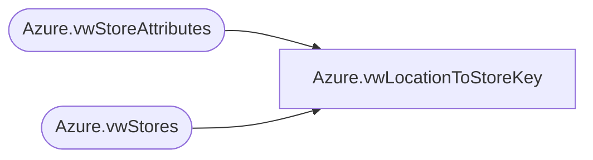

# Azure.vwLocationToStoreKey

**Database:** dw  
**Server:** papamart  

## Architecture Diagram



## Table Dependencies

| Referenced Table |
|---|
| Azure.vwStoreAttributes |
| Azure.vwStores |

## View Code

```sql
CREATE VIEW [Azure].[vwLocationToStoreKey]
AS
SELECT        
	Azure.vwStores.StoreKey, 
	Azure.vwStoreAttributes.LocationID
FROM 
	Azure.vwStoreAttributes 
	JOIN Azure.vwStores ON Azure.vwStoreAttributes.StoreNumber = Azure.vwStores.StoreNumber
```

