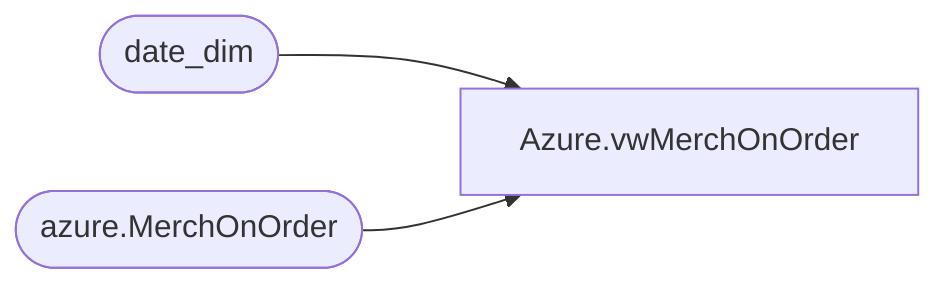

# Azure.vwMerchOnOrder

**Database:** dw  
**Server:** papamart  

## Architecture Diagram



## Table Dependencies

| Referenced Table |
|---|
| date_dim |
| azure.MerchOnOrder |

## View Code

```sql
CREATE view [Azure].[vwMerchOnOrder]

as
-- =============================================================================================================
-- Name: [Azure].[vwMerchOnOrder]
--
-- Description: Product Dimension
--
--
-- Dependencies: 
--
-- Revision History
--		Name:				Date:			Comments:
--		John Eck			12/19/2018		Initial Creation

--											
-- =============================================================================================================

With D as (

select fiscal_Year,Fiscal_period,Min(Actual_Date) - 7 as NewStart,Max(Actual_date) -7 as NewEnd from date_dim group by Fiscal_year,Fiscal_period

),

D2 as (select d.fiscal_Year,d.Fiscal_period,t.Actual_Date as DateKey,DateDiff("d",t.Actual_Date,NewEnd) TotalFlag
 from date_Dim t inner join D on NewStart <= t.Actual_Date and NewEnd >= t.Actual_Date

where datePart("dw",t.actual_date) = 7 )

--select d.style_ID,d.Location_id,  left(Merch_year_pd,4) as Fiscal_Year,    Right(Merch_year_pd,2) as Fiscal_Period,
--sum(On_Order_Units) as On_Order,DateKey,((left(Merch_year_pd,4) - 2017) * 12) +  Right(Merch_year_pd,2) AS PeriodKey,TotalFlag

--from bedrockdb02.ma_01.dbo.oo_all_style_loc_pd d
--inner join D2 on (Fiscal_Year = left(Merch_year_pd,4) and Fiscal_period =  Right(Merch_year_pd,2))
--inner join Azure.vwLocationToStoreKey t on d.location_ID = t.locationID
--inner join bedrockdb02.ma_01.dbo.style a on d.style_ID = a.style_id
--inner join azure.vwStyleToProdKey T2 on a.style_code = T2.style
--where left(Merch_year_pd,4) >= 2017
--group by  d.style_ID,Location_id, Left(Merch_year_pd,4),    Right(Merch_year_pd,2),DateKey,TotalFlag
--having sum(On_Order_Units) > 0

select
	style_ID,
	Location_id,  
	Fiscal_Year,    
	Fiscal_Period,
	On_Order,
	DateKey,
	PeriodKey,
	TotalFlag
from azure.MerchOnOrder
```

