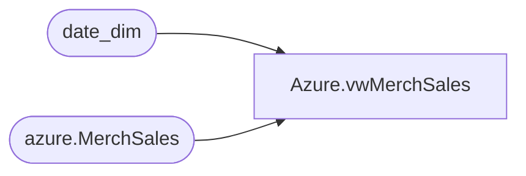

# Azure.vwMerchSales

**Database:** dw  
**Server:** papamart  

## Architecture Diagram



## Table Dependencies

| Referenced Table |
|---|
| date_dim |
| azure.MerchSales |

## View Code

```sql
CREATE view [Azure].[vwMerchSales]

as
-- =============================================================================================================
-- Name: [Azure].[vwMerchSales]
--
-- Description: Product Dimension
--
--
-- Dependencies: 
--
-- Revision History
--		Name:				Date:			Comments:
--		John Eck			12/19/2018		Initial Creation
--		Dan Tweedie			2019-09-20		Removed filter that was limiting merch_year_wk (where Merch_year_wk between 201701 and 201853)
--											
-- =============================================================================================================
With Da as (Select Actual_date,fiscal_week,fiscal_year from date_dim where datepart(dw,actual_date) = 7)

--select ProductKey,StoreKey,Left(Merch_year_wk,4) as FiscalYear,Right(Merch_year_wk,2) as FiscalWeek ,
--sum(sales_total_units-return_units) as NetSalesUnits,sum(sales_total_retail_te-return_retail_te) as NetSalesRetail 
--,Actual_date as DateKey
--from bedrockdb02.ma_01.dbo.hist_style_loc_wk d
--inner join bedrockdb02.ma_01.dbo.style a on d.style_ID = a.style_id
--inner join Azure.vwStyleToProdKey p on a.style_code = p.style
--inner join Azure.vwLocationToStoreKey S on d.location_id = s.Locationid 
--inner join da on (fiscal_year = Left(Merch_year_wk,4) and fiscal_week = Right(Merch_year_wk,2))
--where Merch_year_wk >= 201701 
--group by ProductKey,StoreKey,Left(Merch_year_wk,4) ,Right(Merch_year_wk,2) ,Actual_date
--having sum(sales_total_units-return_units) <> 0

select 
	ProductKey,
	StoreKey, 
	FiscalYear, 
	FiscalWeek, 
	NetSalesUnits,
	NetSalesRetail,
	cast(DateKey as date) as DateKey
from azure.MerchSales
```

