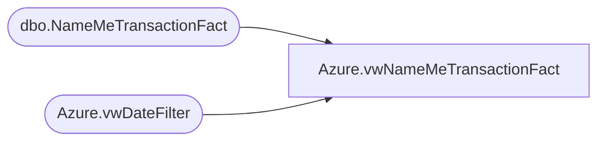

# Azure.vwNameMeTransactionFact

**Database:** dw  
**Server:** papamart  

## Architecture Diagram



## Table Dependencies

| Referenced Table |
|---|
| dbo.NameMeTransactionFact |
| Azure.vwDateFilter |

## View Code

```sql
CREATE view [Azure].[vwNameMeTransactionFact]

AS
-- =============================================================================================================
-- Name: [Azure].[vwNameMeTransactionFact]
--
-- Description: Transaction data at the header level.
--
--
-- Dependencies: 
--
-- Revision History
--		Name:				Date:			Comments:
--		Tim Bytnar	 		4/10/2018		Initial creation
--
-- =============================================================================================================
SELECT n.[NameMeTransactionKey],
      CONVERT(VARCHAR,n.StoreKey) as StoreKey,
	  --,ds.[StoreKey]
      n.[ProductKey]
	  ,'0' as AnimalBarCode
	  ,'o' AS AnimalName
	  ,'01/01/01' as AnimalBirthDate
      ,n.[NameMeTransactionNumber]
      ,n.[TransactionStartDate] AS TransactionDateTime
      ,CAST(n.[TransactionStartDate] AS DATE) AS TransactionDate
      ,n.[TransactionDuration]
      ,CASE WHEN n.[Gift]=0 THEN 'No'
			WHEN n.[Gift]=1 THEN 'Yes'
			WHEN n.[Gift] IS NULL THEN 'Unknown'
			ELSE 'Unknown'
		END AS Gift
      ,CASE WHEN n.[FirstVisit]=0 THEN 'No'
			WHEN n.[FirstVisit]=1 THEN 'Yes'
			WHEN n.[FirstVisit] IS NULL THEN 'Unknown'
			ELSE 'Unknown'
		END AS FirstVisit
      ,n.[Age]
      ,n.[TransactionSource]
      ,n.[Gender]
      ,n.[InsertedDate]
	  ,n.POSTransactionID as TransactionID
	  ,Cast(n.POSTransactionID as varchar(20)) + cast(n.[StoreKey] as varchar(10)) as TransactionKey
  FROM [dw].[dbo].[NameMeTransactionFact] n 
  --INNER JOIN  [dw].[Azure].[vwStores] ds WITH(NOLOCK) ON ds.StoreKey=CONVERT(VARCHAR,n.StoreKey) 
		inner join Azure.vwDateFilter on Cast(n.TransactionStartDate AS Date) = Actual_Date
```

