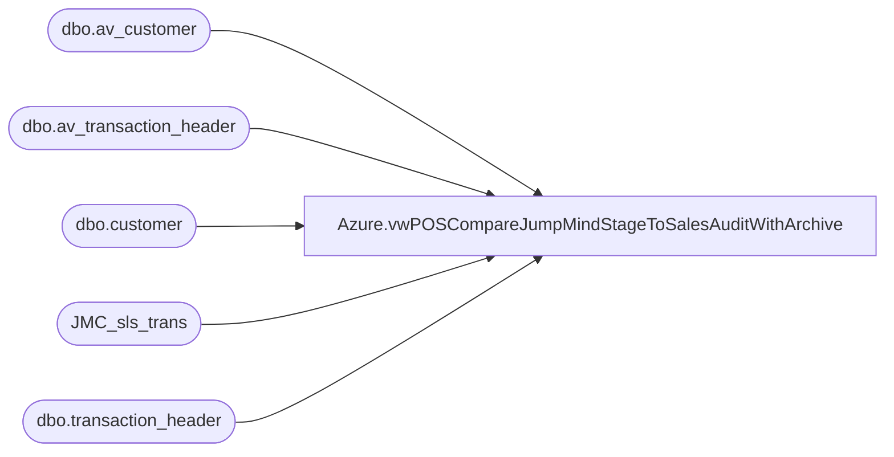

# Azure.vwPOSCompareJumpMindStageToSalesAuditWithArchive

**Database:** dw  
**Server:** papamart  

## Architecture Diagram



## Table Dependencies

| Referenced Table |
|---|
| dbo.av_customer |
| dbo.av_transaction_header |
| dbo.customer |
| JMC_sls_trans |
| dbo.transaction_header |

## View Code

```sql
create view [Azure].[vwPOSCompareJumpMindStageToSalesAuditWithArchive]

as


with
JM as 
	(
		select 
			cast(last_update_time as date) as BusinessDate,
			case 
				when left(business_unit_id,1)='2'
					then business_unit_id
				else cast(right((cast('0000' as varchar) + cast(right(business_unit_id,3) as varchar)),4) as int)
			end as StoreID,
			cast(right(device_id,2) as int) as RegisterNumber,
			trans_nbr,
			total,
			trans_type,
			trans_status,
			loyalty_card_number,
			customer_id,
			username as Employee,
			InsertDate
		from dw..JMC_sls_trans  with (nolock)
		where 1=1 
		and 
			(
				cast(last_update_time as date) >='2023-04-12' --first day of new POs -- 
				--and datediff(dd, business_date, getdate())<=7
			)
		and ---NEED TO VERIFY IF TEH 13/2013 ARE ONLY 'ENTERPRISE SELLING' (BUY IN STORE, SHIP FROM WEB) OR IF THEY ARE BOPIS (BUY ON WEB, SHIP FROM STORE)
			case 
				when left(business_unit_id,1)='2'
					then business_unit_id
				else cast(right((cast('0000' as varchar) + cast(right(business_unit_id,3) as varchar)),4) as int)
			end not in ('0013','2013')
	),
SA as
	(
		select 
			th.transaction_id,
			th.store_no,
			th.register_no,
			th.entry_date_time,
			th.transaction_no,
			th.tender_total,
			cast(th.transaction_date as date) TransactionDate,
			cast(entry_date_time as date) EntryDate,
			c.customer_no
		from bedrockdb01.auditworks.dbo.transaction_header th with (nolock)
		left join bedrockdb01.auditworks.dbo.customer c  with (nolock)
			on th.transaction_id=c.transaction_id 
			and c.customer_role in (1,4)
		where th.store_no not in (13,2013)
		UNION
		select 
			th.av_transaction_id,
			th.store_no,
			th.register_no,
			th.entry_date_time,
			th.transaction_no,
			th.tender_total,
			cast(th.transaction_date as date) TransactionDate,
			cast(entry_date_time as date) EntryDate,
			c.customer_no
		from bedrockdb01.auditworks.dbo.av_transaction_header th with (nolock)
		left join bedrockdb01.auditworks.dbo.av_customer c  with (nolock)
			on th.av_transaction_id=c.av_transaction_id 
			and c.customer_role in (1,4)
		where th.store_no not in (13,2013)
		and datepart(yyyy, th.entry_date_time)=2023
	)
select 
	JM.*,
	SA.*,
	case when loyalty_card_number is NULL then 0 else JM.Total end as LTFSales,
	case when loyalty_card_number is NULL then 0 else ceiling(JM.Total) end as LTFPoints
	--ltf.GaapSales as LTFSales,
	--ceiling(ltf.GaapSales) LTFPoints
from JM 
left join SA 
	on JM.StoreID=SA.Store_no
	and JM.RegisterNumber=sa.register_no
	and JM.trans_nbr=SA.transaction_no 
	and datepart(mm,JM.BusinessDate)=datepart(mm,SA.TransactionDate) --in case they use the wrong business date..at least trying to match
--	and jm.BusinessDate=sa.TransactionDate
```

