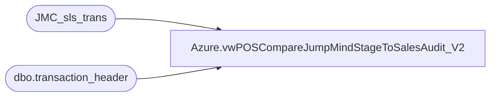

# Azure.vwPOSCompareJumpMindStageToSalesAudit_V2

**Database:** dw  
**Server:** papamart  

## Architecture Diagram



## Table Dependencies

| Referenced Table |
|---|
| JMC_sls_trans |
| dbo.transaction_header |

## View Code

```sql
CREATE view [Azure].[vwPOSCompareJumpMindStageToSalesAudit_V2]

as


with
JMC as 
	(
		select 
			case 
				when datepart(hh, last_update_time)< 2 
					then cast(dateadd(dd,-1, last_update_time) as date) 
				else cast(last_update_time as date) 
			end as SalesAuditTransactionDate,
			cast(last_update_time as date) as BusinessDate,
			case 
				when left(business_unit_id,1)='2'
					then business_unit_id
				else cast(right((cast('0000' as varchar) + cast(right(left(business_unit_id,4), 3) as varchar)),4) as int)
			end as StoreID,
			device_id,
			create_time,
			cast(right(device_id,2) as int) as RegisterNumber,
			trans_nbr,
			total,
			trans_type,
			trans_status,
			last_update_time,
			InsertDate, 
			business_unit_id
		from dw..JMC_sls_trans with (nolock)
		where 1=1 
			and trans_status='COMPLETED' 
		and case 
				when left(business_unit_id,1)='2'
					then business_unit_id
				else cast(right((cast('0000' as varchar) + cast(right(left(business_unit_id,4), 3) as varchar)),4) as int)
			end not in ('0013','2013')
	)
select jmc.*
from JMC jmc
where not exists 
	(
		select 
			th.transaction_id
		from bedrockdb01.auditworks.dbo.transaction_header th with (nolock)
		where 1=1
		and th.store_no=jmc.StoreID
		and th.register_no=jmc.RegisterNumber
		and th.transaction_no=jmc.trans_nbr
		and cast(th.entry_date_time as date) =cast(jmc.create_time as date)
		--UNION
		--select 
		--	th.av_transaction_id
		--from bedrockdb01.auditworks.dbo.av_transaction_header th with (nolock)
		--where 1=1
		--and th.entry_date_time>=getdate()-30
		--and th.store_no=jmc.StoreID
		--and th.register_no=jmc.RegisterNumber
		--and th.transaction_no=jmc.trans_nbr
		--and cast(th.entry_date_time as date) =cast(jmc.create_time as date)
	)


dbo,vwGST_SUM_FACT,/***********************************************************************************************
Object Name:	dbo.vwGST_SUM_FACT
Author:			Funmi Agbebi
Created Date:	3/6/2009
Purpose:		View used for reporting.  Primarily used by BO universes to 
				conveniently access all relevant pieces of Guest demographic and summary
				information.  Sourced from Kiosk registrations only.
				Joins GST_SUM_FACT to CLNSD_GST_DIM and date_dim

-- Revision History
--		Name:					Date:			Comments:
--		Funmi Agbebi			Created
--		Keith Missey			02/08/2011		updated for preference center changes; 
--												didn't change column names because didn't know how BO would be impacted
**********************************************************************************************/

CREATE VIEW [dbo].[vwGST_SUM_FACT]
AS  SELECT  f.actual_date GstFrstStrVstDt,
            f.fiscal_year GstFrstStrVstFY,
            s.actual_date GstScndStrVstDt,
            s.fiscal_year GstScndStrVstFY,
            t.actual_date GstThrdStrVstDt,
            t.fiscal_year GstThrdStrVstFY,
            l.actual_date GstLastStrVstDt,
            l.fiscal_year GstLastStrVstFY,
            i.actual_date GstSumFactUpdtDt,
            c.FRST_NM,
            c.LAST_NM,
            c.NCK_NM,
            c.BRTH_DT,
            c.LYLTY_GST_NBR,
            case when c.LYLTY_GST_NBR is not null then 'Y'
                 else 'N'
            end as Loyalty_Member,
            c.HOH_LYLTY_GST_NBR,
            case when c.HOH_LYLTY_GST_NBR is not null then 'Y'
                 else 'N'
            end as Loyalty_Household,
            c.EMAIL_ADDR_ID,
            e.EMAIL_ADDR_TXT,
            ep.UPDT_SRC_SYS_CD AS OPT_IN_SRC_SYS_CD,
            CASE WHEN promo_pref = 'Y' AND email_stat_cd = 'VALID' THEN 'OPT-IN'
				ELSE 'OPT-OUT' END AS EMAIL_STAT_CD,
            ep.UPDT_DT AS GLBL_OPT_IN_DT,
            p.EMAIL_PRSNLZTN_ATTR_SEQ_NBR,
            p.[EMAIL_FRST_NM],
            p.[EMAIL_LAST_NM],
            p.[EMAIL_BRTH_DT],
            p.[CNTRY_ABBRV],
            CASE when c.FRST_NM = p.EMAIL_FRST_NM
                      and c.LAST_NM = p.EMAIL_LAST_NM then 'Y'
                 else 'N'
            END as HEAD_OF_EMAIL,
            g.*
    FROM    [dbo].[GST_SUM_FACT] g with ( nolock )
            left join dbo.[CLNSD_GST_DIM] c on g.[CLNSD_GST_ID] = c.[CLNSD_GST_ID]
            left join dbo.[EMAIL_ADDR_DIM] e on c.[EMAIL_ADDR_ID] = e.[EMAIL_ADDR_ID]
            left join [dbo].[EMAIL_ADDR_PRSNLZTN_ATTR_DIM] p WITH ( NOLOCK ) ON e.[EMAIL_ADDR_ID] = p.[EMAIL_ADDR_ID]
            LEFT JOIN dbo.EMAIL_ADDR_PRFRNCE_DIM ep WITH (NOLOCK) ON p.EMAIL_ADDR_ID = ep.EMAIL_ADDR_ID
            left join dbo.date_dim f with ( nolock ) on g.[FRST_STR_VST_DT_ID] = f.date_key
            left join dbo.date_dim s with ( nolock ) on g.[SCND_STR_VST_DT_ID] = s.date_key
            left join dbo.date_dim t with ( nolock ) on g.[THRD_STR_VST_DT_ID] = t.date_key
            left join dbo.date_dim l with ( nolock ) on g.[LAST_STR_VST_DT_ID] = l.date_key
            left join dbo.date_dim i with ( nolock ) on g.[GST_SUM_FACT_UPDT_DT_ID] = i.date_key
```

