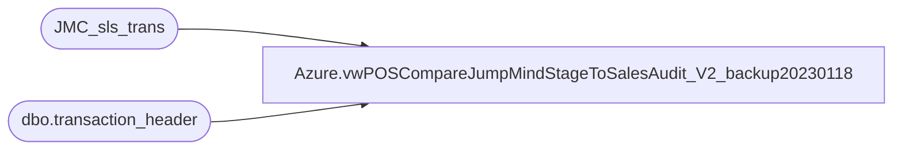

# Azure.vwPOSCompareJumpMindStageToSalesAudit_V2_backup20230118

**Database:** dw  
**Server:** papamart  

## Architecture Diagram



## Table Dependencies

| Referenced Table |
|---|
| JMC_sls_trans |
| dbo.transaction_header |

## View Code

```sql
CREATE view [Azure].[vwPOSCompareJumpMindStageToSalesAudit_V2_backup20230118]

as


select 
	case 
		when datepart(hh, last_update_time)< 2 
			then cast(dateadd(dd,-1, last_update_time) as date) 
		else cast(last_update_time as date) 
	end as SalesAuditTransactionDate,
	cast(last_update_time as date) as BusinessDate,
	case 
		when left(business_unit_id,1)='2'
			then business_unit_id
		else cast(right((cast('0000' as varchar) + cast(right(business_unit_id,3) as varchar)),4) as int)
	end as StoreID,
	cast(right(device_id,2) as int) as RegisterNumber,
	trans_nbr,
	total,
	trans_type,
	trans_status,
	last_update_time,
	InsertDate, 
	business_unit_id,
	device_id,
	right(device_id,3) as RegNum
from dw..JMC_sls_trans with (nolock)
where 1=1 
	and isnumeric(right(device_id,2))=1
	and trans_status='COMPLETED' 
and case 
		when left(business_unit_id,1)='2'
			then business_unit_id
		else cast(right((cast('0000' as varchar) + cast(right(business_unit_id,3) as varchar)),4) as int)
	end not in ('0013','2013')

	and not exists 
	(
		select 
			th.transaction_id
		from bedrockdb01.auditworks.dbo.transaction_header th with (nolock)
		where th.store_no not in (13,2013)
		and th.store_no=case 
				when left(business_unit_id,1)='2'
					then business_unit_id
				else cast(right((cast('0000' as varchar) + cast(right(business_unit_id,3) as varchar)),4) as int)
			end
		and th.register_no=cast(right(device_id,2) as int)
		and th.transaction_no=trans_nbr
		and cast(entry_date_time as date) =cast(create_time as date)
		--UNION
		--select 
		--	th.av_transaction_id
		--from bedrockdb01.auditworks.dbo.av_transaction_header th with (nolock)
		--where datediff(dd, th.entry_date_time, getdate())<=40
		--and th.store_no not in (13,2013)
		--and th.store_no=case 
		--		when left(business_unit_id,1)='2'
		--			then business_unit_id
		--		else cast(right((cast('0000' as varchar) + cast(right(business_unit_id,3) as varchar)),4) as int)
		--	end
		--and th.register_no=cast(right(device_id,2) as int)
		--and th.transaction_no=trans_nbr
		--and cast(entry_date_time as date) =cast(last_update_time as date)
	)
```

