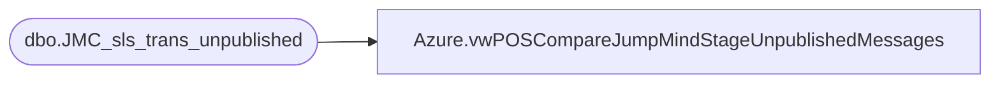

# Azure.vwPOSCompareJumpMindStageUnpublishedMessages

**Database:** dw  
**Server:** papamart  

## Architecture Diagram



## Table Dependencies

| Referenced Table |
|---|
| dbo.JMC_sls_trans_unpublished |

## View Code

```sql
CREATE view [Azure].[vwPOSCompareJumpMindStageUnpublishedMessages]

as

SELECT 
	[business_date],
	[create_time],
	[device_id],
	[sequence_nbr],
	[InsertDate] 
FROM [dbo].[JMC_sls_trans_unpublished]
where cast(create_time as date) >='2023-04-12'
```

