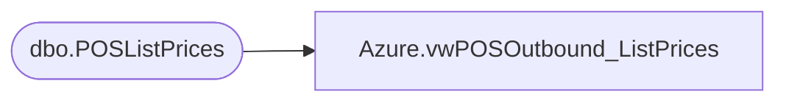

# Azure.vwPOSOutbound_ListPrices

**Database:** dw  
**Server:** papamart  

## Architecture Diagram



## Table Dependencies

| Referenced Table |
|---|
| dbo.POSListPrices |

## View Code

```sql
CREATE VIEW [Azure].[vwPOSOutbound_ListPrices] AS

	 
select * from Bedrockdb02.me_01.dbo.POSListPrices
```

