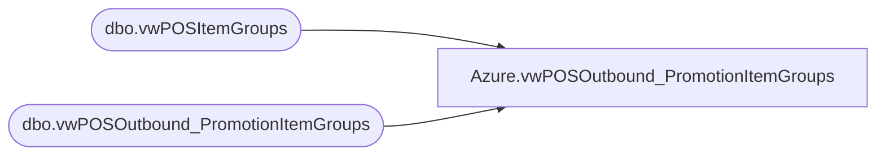

# Azure.vwPOSOutbound_PromotionItemGroups

**Database:** dw  
**Server:** papamart  

## Architecture Diagram



## Table Dependencies

| Referenced Table |
|---|
| dbo.vwPOSItemGroups |
| dbo.vwPOSOutbound_PromotionItemGroups |

## View Code

```sql
CREATE VIEW [Azure].[vwPOSOutbound_PromotionItemGroups] AS

select * from bedrockdb02.me_01.dbo.vwPOSOutbound_PromotionItemGroups

UNION ---NEED TO SWITCH TO KODIAK FOR DEPLOYMENT TO PROD

--select ItemGroupID as 'item_group_id', GroupName as 'item_group_code', GroupName as 'item_group_description', style_code, isExcluded from  kodiak.DiscountMstrData.dbo.vwPOSItemGroups
select ItemGroupID as 'item_group_id', GroupName as 'item_group_code', GroupName as 'item_group_description',  right(('000000' + CAST(style_code AS VARCHAR)), 6), isExcluded from  kodiak.DiscountMstrData.dbo.vwPOSItemGroups

--select cast(cast('900' as varchar) + cast(ig.ItemGroupID as varchar) as int) as item_group_id, ig.GroupName as item_group_code, ig.GroupName as item_group_description,  p.style_code 
--from  kodiaktest.DiscountMstrData.dbo.ItemGroups ig 
--join kodiaktest.DiscountMstrData.dbo.ItemGroupsCriteria igc on ig.ItemGroupID = igc.ItemGroupID and igc.ItemTypeID= 2 --styles
--join kodiaktest.DiscountMstrData.dbo.Country c on ig.CountryID = c.countryID 
--join kodiaktest.DiscountMstrData.dbo.Products p     on igc.ItemID=p.style_id     and c.abbrv=p.jurisdiction_code 

--order by item_group_id, style_code
```

