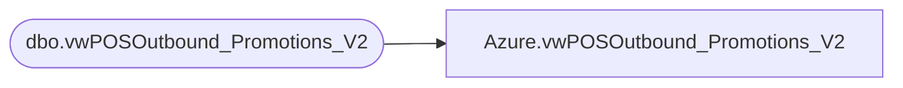

# Azure.vwPOSOutbound_Promotions_V2

**Database:** dw  
**Server:** papamart  

## Architecture Diagram



## Table Dependencies

| Referenced Table |
|---|
| dbo.vwPOSOutbound_Promotions_V2 |

## View Code

```sql
CREATE VIEW [Azure].[vwPOSOutbound_Promotions_V2] AS

select * from bedrockdb02.me_01.dbo.vwPOSOutbound_Promotions_V2
```

