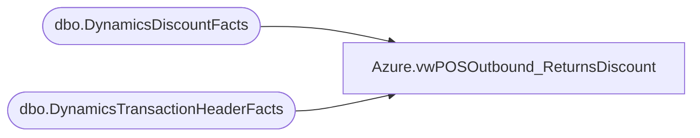

# Azure.vwPOSOutbound_ReturnsDiscount

**Database:** dw  
**Server:** papamart  

## Architecture Diagram



## Table Dependencies

| Referenced Table |
|---|
| dbo.DynamicsDiscountFacts |
| dbo.DynamicsTransactionHeaderFacts |

## View Code

```sql
CREATE VIEW [Azure].[vwPOSOutbound_ReturnsDiscount] AS

--POS_ReturnsDiscount
with 
Header as 
	(
		select * 
		from [dbo].[DynamicsTransactionHeaderFacts] (nolock) 
		where datediff(dd, TransDate, getdate())<=45
		and isCurrent=1
	)
select * 
from [dbo].[DynamicsDiscountFacts] (nolock) 
where RetailTransactionId in (select RetailTransactionId from Header)
and isCurrent=1 ;
```

