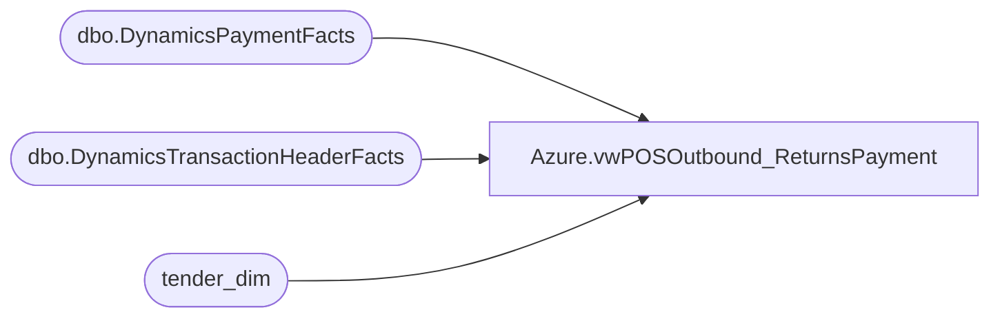

# Azure.vwPOSOutbound_ReturnsPayment

**Database:** dw  
**Server:** papamart  

## Architecture Diagram



## Table Dependencies

| Referenced Table |
|---|
| dbo.DynamicsPaymentFacts |
| dbo.DynamicsTransactionHeaderFacts |
| tender_dim |

## View Code

```sql
CREATE VIEW [Azure].[vwPOSOutbound_ReturnsPayment] AS

with 
Header as 
	(
		select * 
		from [dbo].[DynamicsTransactionHeaderFacts] (nolock) 
		where datediff(dd, TransDate, getdate())<=45
		and isCurrent=1
	)
--select *
--from  dbo.DynamicsPaymentFacts (nolock) 
--where RetailTransactionId in (select RetailTransactionId from Header)
--and isCurrent=1 ;
SELECT dpf.[DynamicsPaymentFactsId],dpf.[AmountCur],dpf.[AmountMst],dpf.[RetailAmountTendered],dpf.[RetailCardTypeId],
dpf.[RetailReceiptId],dpf.[LineNum],dpf.[RetailTransactionId],dpf.[RetailTenderTypeId]
      ,dpf.[RetailTerminalId],dpf.[BABIntRetailOperatingUnitNumber],dpf.[TransDate],dpf.[AccountNum],dpf.[RetailCardNum],dpf.[ChangeLine],
	  dpf.[PaymentAuthorization],dpf.[CurrencyCode]
      ,dpf.[BABIntRetailProcessed],dpf.[Entity],dpf.[IsCurrent],dpf.[IsNegatedCurrent],dpf.[InsertDate],dpf.[UpdateDate],dpf.[CurrentSentDate],dpf.[NegativeSentDate],
	  dpf.[BatchID], td.tender_code, td.tender_desc,
	  case when td.tender_code is null and dpf.[RetailCardTypeId] is not null then dpf.[RetailCardTypeId]
	       when dpf.[RetailCardTypeId] is null and td.tender_code is not null then td.tender_desc
		   else 'unknown' end as 'RetailCardTypeIdTenderDesc'
  from  dbo.DynamicsPaymentFacts (nolock) dpf
  left join tender_dim td on dpf.RetailTenderTypeId = td.tender_code
where RetailTransactionId in (select RetailTransactionId from Header)
and isCurrent=1 ;
```

