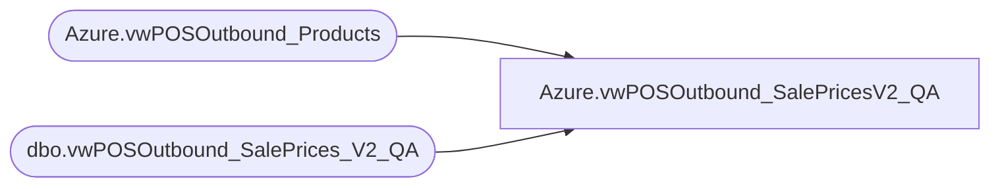

# Azure.vwPOSOutbound_SalePricesV2_QA

**Database:** dw  
**Server:** papamart  

## Architecture Diagram



## Table Dependencies

| Referenced Table |
|---|
| Azure.vwPOSOutbound_Products |
| dbo.vwPOSOutbound_SalePrices_V2_QA |

## View Code

```sql
CREATE VIEW [Azure].[vwPOSOutbound_SalePricesV2_QA] AS

	 
select
deal_discount_id, 
deal_id, 
deal_no, 
deal_name, 
deal_description, 
DealStartDate, 
DealEndDate, 
deal_discount_type, 
deal_discount_name, 
DealTierDef_DiscType, 
DealTierDef_DiscPct, 
DealTierDef_DiscAmt, 
DealTierDef_DiscAppliesTo, 
DealTierDef_DiscQty, 
DealTierDef_AddlInfo, 
DealTierDef_ThresholdType, 
DealTierDef_ThresholdQty, 
DealTierDef_ThresholdAmt, 
DealItemRequired_ItemGroup, 
DealItemReqQty, 
DealLocationJurisdictionCode, 
DealLocation, 
DealItemDiscSpec_IdentityType, 
DealItemDiscSpec_Qty, 
DealItemDiscSpec_DiscType, 
DealItemDiscSpec_DiscPct, 
DealItemDiscSpec_DiscAmt, 
DealItemDiscSpec_DiscAppliesTo

from Bedrockdb02.me_01.dbo.vwPOSOutbound_SalePrices_V2_QA


where DealItemRequired_ItemGroup  in
(select ProductNumber from [Azure].[vwPOSOutbound_Products] )
```

