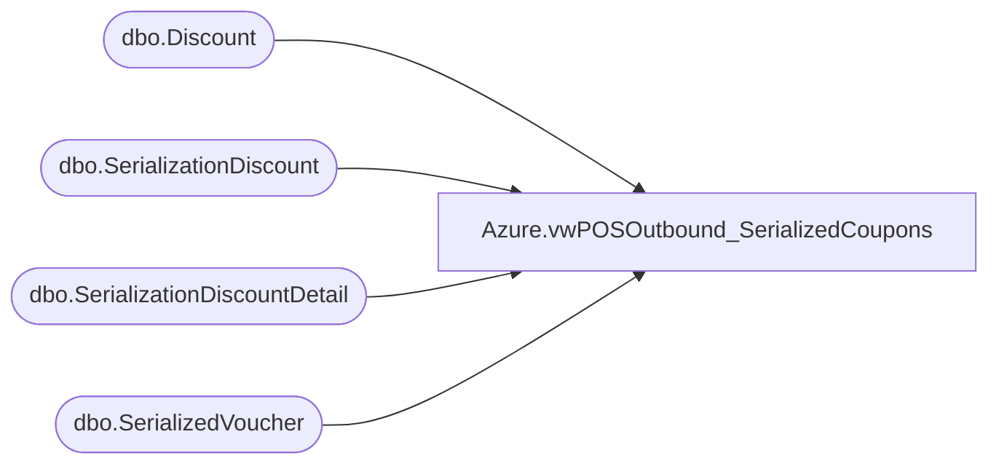

# Azure.vwPOSOutbound_SerializedCoupons

**Database:** dw  
**Server:** papamart  

## Architecture Diagram



## Table Dependencies

| Referenced Table |
|---|
| dbo.Discount |
| dbo.SerializationDiscount |
| dbo.SerializationDiscountDetail |
| dbo.SerializedVoucher |

## View Code

```sql
CREATE VIEW [Azure].[vwPOSOutbound_SerializedCoupons] AS


select 
	left(Description,2) as Country,
	CouponID,
	--max(Description) as Description,
	replace(case when max(Description)='USBCReward$10' then 'BC Reward $10' else max(Description) end,'£',' ') as Description,
	DiscountAmount,
	case 
		when CouponID in ('2005124','2005297','2005298') then '0.01'
		when CouponID in ('2005305','2005306') then '30.00'
		when CouponID in ('2005307','2005308') then '20.00'
	end as MinimumSpend,
	'2022-8-1' as StartDate, -- 
	'3030-12-31' as EndDate, --
	'RWD' as VoucherType,
	'SalesForceLoyalty' as DataSource,
	count(*) VoucherCount
from papamart.dw.dbo.SerializedVoucher 
where Description<>'' 
and DiscountAmount is not null 
--and CouponID = '2005298'
and SerializedNumber not in ('20056312584971206','20056329822514596')
and cast(InsertDate as date) >= '06/01/2023'
group by 
	CouponID,
	--Description,
	DiscountAmount,
	left(Description,2)

	UNION

	
select 
	left(Description,2) as Country,
	CouponID,
	--max(Description) as Description,
	replace(case when max(Description)='USBCReward$10' then 'BC Reward $10' else max(Description) end,'£',' ') as Description,
	DiscountAmount,
	case 
		when CouponID in ('2005124','2005297','2005298') then '0.01'
		when CouponID in ('2005305','2005306') then '30.00'
		when CouponID in ('2005307','2005308') then '20.00'
	end as MinimumSpend,
	'2022-8-1' as StartDate, -- 
	'3030-12-31' as EndDate, --
	'CPN' as VoucherType,
	'SalesForceLoyalty' as DataSource,
	count(*) VoucherCount
from papamart.dw.dbo.SerializedVoucher 
where Description<>'' 
and DiscountAmount is not null 
--and CouponID = '2005298'
and SerializedNumber not in ('20056312584971206','20056329822514596')
and cast(InsertDate as date) >= '06/01/2023'
group by 
	CouponID,
	--Description,
	DiscountAmount,
	left(Description,2)


	UNION

select 
	'CA' as Country,
	CouponID,
	case when max(Description)='USBCReward$10' then 'BC Reward $10' else max(Description) end as Description,
	DiscountAmount,
	case 
		when CouponID in ('2005124','2005297','2005298') then '0.01'
		when CouponID in ('2005305','2005306') then '30.00'
		when CouponID in ('2005307','2005308') then '20.00'
	end as MinimumSpend,
	'2022-8-1' as StartDate, -- 
	'3030-12-31' as EndDate, --
	'RWD' as VoucherType,
	'SalesForceLoyalty' as DataSource,
	count(*) VoucherCount
from papamart.dw.dbo.SerializedVoucher 
where  Description<>''
and Country = 'US'
and DiscountAmount is not null 
--and CouponID = '2005298'
and SerializedNumber not in ('20056312584971206','20056329822514596')
and cast(InsertDate as date) >= '06/01/2023'
group by 
	CouponID,
	--Description,
	DiscountAmount,
	left(Description,2) 

UNION

select 
	'CA' as Country,
	CouponID,
	case when max(Description)='USBCReward$10' then 'BC Reward $10' else max(Description) end as Description,
	DiscountAmount,
	case 
		when CouponID in ('2005124','2005297','2005298') then '0.01'
		when CouponID in ('2005305','2005306') then '30.00'
		when CouponID in ('2005307','2005308') then '20.00'
	end as MinimumSpend,
	'2022-8-1' as StartDate, -- 
	'3030-12-31' as EndDate, --
	'CPN' as VoucherType,
	'SalesForceLoyalty' as DataSource,
	count(*) VoucherCount
from papamart.dw.dbo.SerializedVoucher 
where  Description<>''
and Country = 'US'
and DiscountAmount is not null 
--and CouponID = '2005298'
and SerializedNumber not in ('20056312584971206','20056329822514596')
and cast(InsertDate as date) >= '06/01/2023'
group by 
	CouponID,
	--Description,
	DiscountAmount,
	left(Description,2) 

	--====== KODIAK

UNION
select 
	sd.cntryAbbr, 
	d.couponNumber CouponID, 
	replace(d.Title,'US ', '') as Description, 
	sd.Discountamount, 
	sd.minimum_order_amount as MinimumSpend,
	cast(d.StartDate as date) StartDate,
	cast(d.EndingDate as date) EndDate,
	'CPN'  as VoucherType,
	--min(serializedNum) MinSerializedNum,
	--max(serializedNum) MaxSerializedNum,
	'DiscountManager' as DataSource,
	Count(distinct serializedNum) VoucherCount
FROM kodiak.DiscountMstrData.dbo.Discount d
INNER JOIN kodiak.DiscountMstrData.dbo.SerializationDiscount sd ON d.discountID = sd.discountID
LEFT JOIN kodiak.DiscountMstrData.dbo.SerializationDiscountDetail sdd ON sd.serializationID = sdd.serializationID
where cast(d.StartDate as date) <= cast(getdate() as date)
and cast(isnull(d.EndingDate, '3030-12-31') as date) >= cast(getdate() as date)
and d.isApproved=1
and d.couponNumber not in (select distinct CouponID from dw.dbo.SerializedVoucher)
and d.isSerializedCoupon=1
group by 
	d.couponNumber, 
	d.Title, 
	sd.Discountamount, 
	sd.minimum_order_amount,
	sd.cntryAbbr, 
	d.rptDescription,
	d.Notes,
	cast(d.StartDate as date), 
	cast(d.EndingDate as date)
UNION
select 
	'CA' as cntryAbbr, 
	d.couponNumber as CouponID, 
	replace(d.Title,'US ', '') as Description, 
	sd.Discountamount, 
	sd.minimum_order_amount as MinimumSpend,
	cast(d.StartDate as date) StartDate,
	cast(d.EndingDate as date) EndDate,
	'CPN'  as VoucherType,
	--min(serializedNum) MinSerializedNum,
	--max(serializedNum) MaxSerializedNum,
	'DiscountManager' as DataSource,
	Count(distinct serializedNum) VoucherCount
FROM kodiak.DiscountMstrData.dbo.Discount d
INNER JOIN kodiak.DiscountMstrData.dbo.SerializationDiscount sd ON d.discountID = sd.discountID
LEFT JOIN kodiak.DiscountMstrData.dbo.SerializationDiscountDetail sdd ON sd.serializationID = sdd.serializationID
where cast(d.StartDate as date) <= cast(getdate() as date)
and cast(isnull(d.EndingDate, '3030-12-31') as date) >= cast(getdate() as date)
and d.isApproved=1
and d.couponNumber not in (select distinct CouponID from dw.dbo.SerializedVoucher)
and d.isSerializedCoupon=1
and sd.cntryAbbr='US'
group by 
	d.couponNumber, 
	d.Title, 
	sd.Discountamount, 
	sd.minimum_order_amount,
	sd.cntryAbbr, 
	d.rptDescription,
	d.Notes,
	cast(d.StartDate as date), 
	cast(d.EndingDate as date)
```

