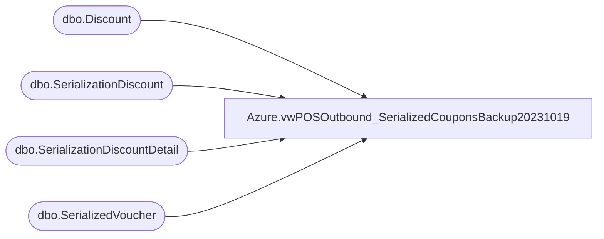

# Azure.vwPOSOutbound_SerializedCouponsBackup20231019

**Database:** dw  
**Server:** papamart  

## Architecture Diagram



## Table Dependencies

| Referenced Table |
|---|
| dbo.Discount |
| dbo.SerializationDiscount |
| dbo.SerializationDiscountDetail |
| dbo.SerializedVoucher |

## View Code

```sql
create VIEW [Azure].[vwPOSOutbound_SerializedCouponsBackup20231019] AS


select 
	left(Description,2) as Country,
	CouponID,
	max(Description) as Description,
	DiscountAmount,
	case 
		when CouponID in ('2005124','2005297','2005298') then '0.01'
		when CouponID in ('2005305','2005306') then '30.00'
		when CouponID in ('2005307','2005308') then '20.00'
	end as MinimumSpend,
	'2022-8-1' as StartDate, -- 
	'3030-12-31' as EndDate, --
	case 
		when CouponID in ('2005297','2005298') then 'RWD'
		else 'CPN' 
	end as VoucherType,
	--min(SerializedNumber) MinSerializedNum,
	--max(SerializedNumber) MaxSerializedNum,
	'SalesForceLoyalty' as DataSource,
	count(*) VoucherCount
from dw.dbo.SerializedVoucher 
group by 
	CouponID,
	--Description,
	DiscountAmount,
	left(Description,2) 
UNION
select 
	sd.cntryAbbr, 
	d.couponNumber CouponID, 
	d.Title as Description, 
	sd.Discountamount, 
	sd.minimum_order_amount as MinimumSpend,
	cast(d.StartDate as date) StartDate,
	cast(d.EndingDate as date) EndDate,
	'CPN'  as VoucherType,
	--min(serializedNum) MinSerializedNum,
	--max(serializedNum) MaxSerializedNum,
	'DiscountManager' as DataSource,
	Count(distinct serializedNum) VoucherCount
FROM kodiak.DiscountMstrData.dbo.Discount d
INNER JOIN kodiak.DiscountMstrData.dbo.SerializationDiscount sd ON d.discountID = sd.discountID
LEFT JOIN kodiak.DiscountMstrData.dbo.SerializationDiscountDetail sdd ON sd.serializationID = sdd.serializationID
where cast(d.StartDate as date) <= cast(getdate() as date)
and cast(isnull(d.EndingDate, '3030-12-31') as date) >= cast(getdate() as date)
and d.isApproved=1
and d.couponNumber not in (select distinct CouponID from dw.dbo.SerializedVoucher)
and d.isSerializedCoupon=1
group by 
	d.couponNumber, 
	d.Title, 
	sd.Discountamount, 
	sd.minimum_order_amount,
	sd.cntryAbbr, 
	d.rptDescription,
	d.Notes,
	cast(d.StartDate as date), 
	cast(d.EndingDate as date)
--order by 2,1
```

