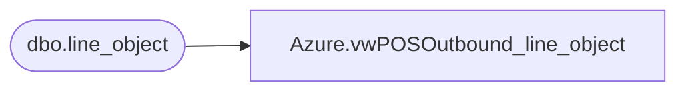

# Azure.vwPOSOutbound_line_object

**Database:** dw  
**Server:** papamart  

## Architecture Diagram



## Table Dependencies

| Referenced Table |
|---|
| dbo.line_object |

## View Code

```sql
CREATE VIEW [Azure].[vwPOSOutbound_line_object] AS

select * from bedrockdb01.auditworks.dbo.line_object
```

