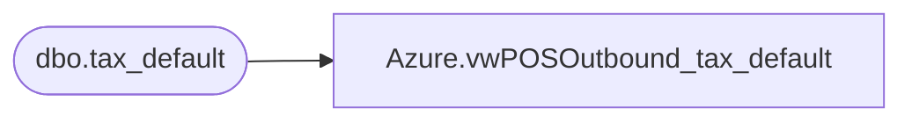

# Azure.vwPOSOutbound_tax_default

**Database:** dw  
**Server:** papamart  

## Architecture Diagram



## Table Dependencies

| Referenced Table |
|---|
| dbo.tax_default |

## View Code

```sql
CREATE VIEW [Azure].[vwPOSOutbound_tax_default] AS

select * from bedrockdb01.auditworks.dbo.tax_default
```

