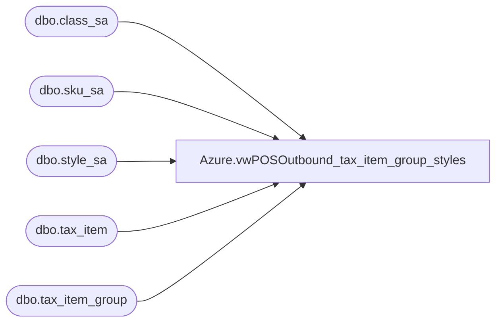

# Azure.vwPOSOutbound_tax_item_group_styles

**Database:** dw  
**Server:** papamart  

## Architecture Diagram



## Table Dependencies

| Referenced Table |
|---|
| dbo.class_sa |
| dbo.sku_sa |
| dbo.style_sa |
| dbo.tax_item |
| dbo.tax_item_group |

## View Code

```sql
CREATE VIEW [Azure].[vwPOSOutbound_tax_item_group_styles] AS


--SELECT  
--    s.style_code,
--    s.style_short_description,
--    s.style_long_description,
--    ti.tax_item_group_code,
--    ti.tax_item_group_description
--    -- @default_tax_item_group_id))+ @32commas,
--                        --I think the default is 10...
--                        --select o.tax_item_group_id
--                        --  FROM line_object o, tax_item_group t
--                        -- WHERE o.tax_item_group_id = t.tax_item_group_id
--                         --o.line_object = @line_object
--    FROM  bedrockdb01.auditworks.dbo.style_sa s
--    join bedrockdb01.auditworks.dbo.class_sa c 
--        on s.upc_lookup_division=c.upc_lookup_division
--        AND  s.class_code=c.class_code
--    join bedrockdb01.auditworks.dbo.tax_item u 
--        on s.upc_lookup_division=u.upc_lookup_division
--        and s.style_reference_id = u.style_reference_id
--   join bedrockdb01.auditworks.dbo.sku_sa sku 
--        on u.upc_lookup_division=sku.upc_lookup_division
--        and u.sku_id=sku.sku
--    join bedrockdb01.auditworks.dbo.tax_item_group ti on isnull(c.tax_item_group_id,10)=ti.tax_item_group_id
----order by 1


SELECT  
	s.style_code,
	s.style_short_description,
	s.style_long_description,
	ti.tax_item_group_code,
	ti.tax_item_group_description
	-- @default_tax_item_group_id))+ @32commas,
						--I think the default is 10...
						--select o.tax_item_group_id
						--  FROM line_object o, tax_item_group t
						-- WHERE o.tax_item_group_id = t.tax_item_group_id
							--o.line_object = @line_object
--into #xx
FROM  bedrockdb01.auditworks.dbo.style_sa s
join bedrockdb01.auditworks.dbo.class_sa c 
	on s.upc_lookup_division=c.upc_lookup_division
	AND  s.class_code=c.class_code
join bedrockdb01.auditworks.dbo.tax_item u 
	on s.upc_lookup_division=u.upc_lookup_division
	and s.style_reference_id = u.style_reference_id
join bedrockdb01.auditworks.dbo.sku_sa sku 
	on u.upc_lookup_division=sku.upc_lookup_division
	and u.sku_id=sku.sku
join bedrockdb01.auditworks.dbo.tax_item_group ti on isnull(c.tax_item_group_id,10)=ti.tax_item_group_id
group by --if item has multiple tax_item rows, it seems to be due to having multiple upcs in the item_no field.. so we get distinct here
	s.style_code,
	s.style_short_description,
	s.style_long_description,
	ti.tax_item_group_code,
	ti.tax_item_group_description
--order by 1
```

