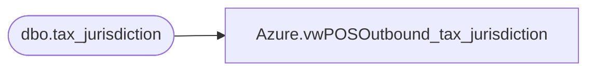

# Azure.vwPOSOutbound_tax_jurisdiction

**Database:** dw  
**Server:** papamart  

## Architecture Diagram



## Table Dependencies

| Referenced Table |
|---|
| dbo.tax_jurisdiction |

## View Code

```sql
CREATE VIEW [Azure].[vwPOSOutbound_tax_jurisdiction] AS

select * from bedrockdb01.auditworks.dbo.tax_jurisdiction

--select 398 as tax_jurisdiction_id, '*IE' as tax_jurisdiction, 'Ireland' as  jurisdiction_name, '9999-9999-11--' as gl_replacement_value, '398' as pos_tax_jurisdiction_code, 1 as active_flag
--union
--select 397 as tax_jurisdiction_id, 'EIRE' as tax_jurisdiction, 'Ireland' as  jurisdiction_name, '9999-9999-1o--' as gl_replacement_value, '397' as pos_tax_jurisdiction_code, 1 as active_flag
--union
--select 323 as tax_jurisdiction_id, 'GBP' as tax_jurisdiction, 'United Kingdom' as  jurisdiction_name, '9999-9999-10--' as gl_replacement_value, '323' as pos_tax_jurisdiction_code, 1 as active_flag
```

