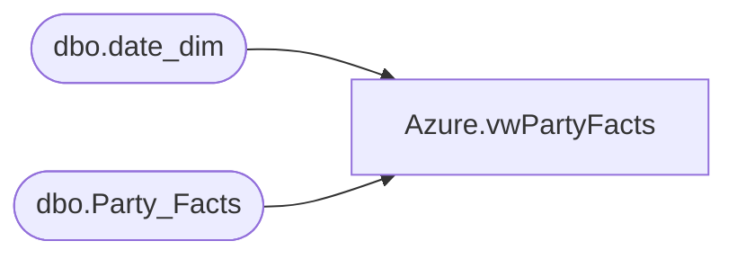

# Azure.vwPartyFacts

**Database:** dw  
**Server:** papamart  

## Architecture Diagram



## Table Dependencies

| Referenced Table |
|---|
| dbo.date_dim |
| dbo.Party_Facts |

## View Code

```sql
CREATE VIEW [Azure].[vwPartyFacts]
AS
SELECT        pf.party_key, pf.OccasionName, ISNULL(pf.PackageName, '') AS PackageName, pf.TotalGuests, ISNULL(pf.GOHAge, 0) AS GOHAge, ISNULL(pf.GuestAvgAge, 0) AS GuestAvgAge, pf.IsCancelled, pf.IsPOParty, 
                         dd1.actual_date AS CreatedDate, dd2.actual_date AS ExecuteDate, pf.CreatedBy, pf.BookingMethod, pf.store_key
FROM            dbo.Party_Facts AS pf LEFT OUTER JOIN
                         dbo.date_dim AS dd1 ON pf.CreatedDateKey = dd1.date_key LEFT OUTER JOIN
                         dbo.date_dim AS dd2 ON pf.ExecuteDateKey = dd2.date_key
```

