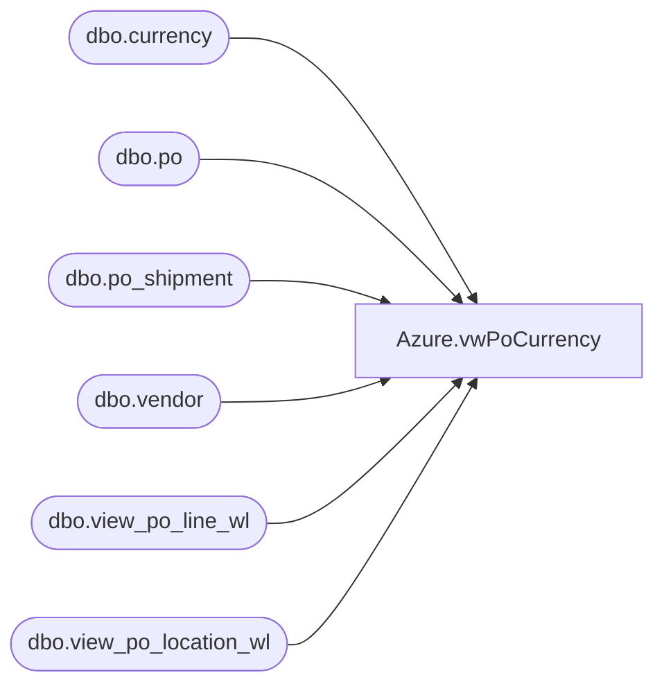

# Azure.vwPoCurrency

**Database:** dw  
**Server:** papamart  

## Architecture Diagram



## Table Dependencies

| Referenced Table |
|---|
| dbo.currency |
| dbo.po |
| dbo.po_shipment |
| dbo.vendor |
| dbo.view_po_line_wl |
| dbo.view_po_location_wl |

## View Code

```sql
CREATE VIEW [Azure].[vwPoCurrency]  AS
-- =============================================================================================================
-- Name: [Azure].[vwPoCurrency]
--
-- Description: 
--
--
-- Dependencies: 
--
-- Revision History
--		Name:				Date:			Comments:
--		John Eck		04/14/2019		Initial creation
--
-- =============================================================================================================


SELECT DISTINCT c.po_no, b.currency_code ,  
convert(smalldatetime,convert(varchar, f.expected_receipt_date,101)) as ReceiptDate, 
d.style_code as Style, d.total_line_first_cost as FirstCost
FROM Bedrockdb02.me_01.dbo.vendor a, 
Bedrockdb02.me_01.dbo.currency b, 
Bedrockdb02.me_01.dbo.po c,
 Bedrockdb02.me_01.dbo.view_po_line_wl d,
  Bedrockdb02.me_01.dbo.view_po_location_wl e, 
  Bedrockdb02.me_01.dbo.po_shipment f 
WHERE a.vendor_id = c.vendor_id  
    AND b.currency_id =c.currency_id  
    AND c.po_id = d.po_id  
    AND c.po_id = f.po_id 
    AND f.po_id = e.po_id 
    AND f.po_shipment_id = e.po_shipment_id  
    AND (b.currency_code = N'CNY' 
    AND convert(smalldatetime,convert(varchar, f.expected_receipt_date,101)) Between   GetDate() - 365 and   GetDate() + 365)
```

