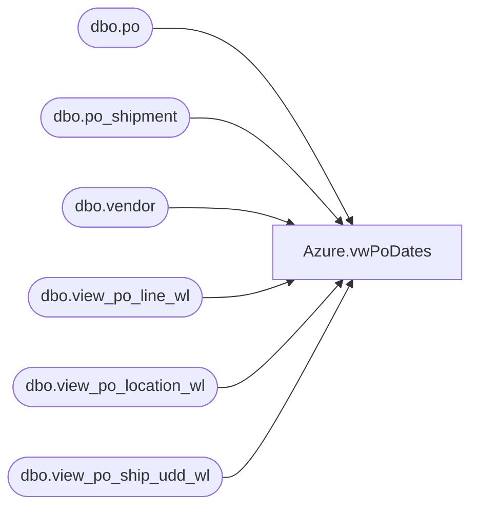

# Azure.vwPoDates

**Database:** dw  
**Server:** papamart  

## Architecture Diagram



## Table Dependencies

| Referenced Table |
|---|
| dbo.po |
| dbo.po_shipment |
| dbo.vendor |
| dbo.view_po_line_wl |
| dbo.view_po_location_wl |
| dbo.view_po_ship_udd_wl |

## View Code

```sql
CREATE VIEW [Azure].[vwPoDates] AS
-- =============================================================================================================
-- Name: [Azure].[vwPoDates]
--
-- Description: Discounts for all transactions beginning two years ago through yesterday.
--
--
-- Dependencies: 
--
-- Revision History
--		Name:				Date:			Comments:
--		John Eck		04/14/2019		Initial creation
--
-- =============================================================================================================

 SELECT DISTINCT v.vendor_name, v.vendor_code, po.po_no, --ploc.location_code , 
 u.date_type_code, u.date_type_desc, u.user_defined_date, s.expected_receipt_date  
FROM Bedrockdb02.me_01.dbo.po join Bedrockdb02.me_01.dbo.vendor v on v.vendor_id=po.vendor_id 
join Bedrockdb02.me_01.dbo.view_po_line_wl pl on pl.po_id=po.po_id 
join Bedrockdb02.me_01.dbo.view_po_location_wl ploc on ploc.po_id=po.po_id 
join Bedrockdb02.me_01.dbo.po_shipment s on s.po_id=po.po_id 
join Bedrockdb02.me_01.dbo.view_po_ship_udd_wl u on u.po_id=po.po_id and u.po_shipment_id=s.po_shipment_id 
WHERE s.expected_receipt_date between   GetDate() - 365 and   GetDate() + 365
```

