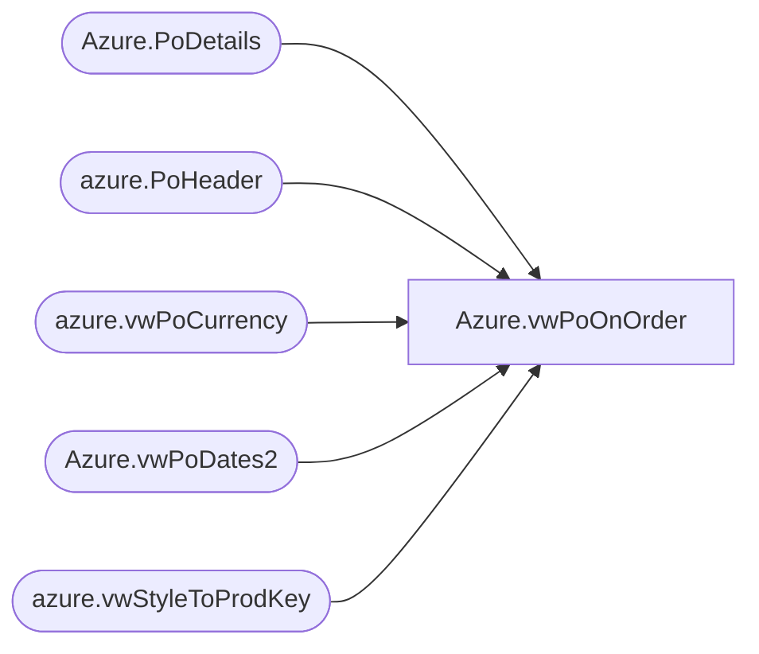

# Azure.vwPoOnOrder

**Database:** dw  
**Server:** papamart  

## Architecture Diagram



## Table Dependencies

| Referenced Table |
|---|
| Azure.PoDetails |
| azure.PoHeader |
| azure.vwPoCurrency |
| Azure.vwPoDates2 |
| azure.vwStyleToProdKey |

## View Code

```sql
CREATE VIEW [Azure].[vwPoOnOrder]  AS
-- =============================================================================================================
-- Name: [Azure].[Azure].[vwPoOnOrder] 
--
-- Description: Discounts for all transactions beginning two years ago through yesterday.
--
--
-- Dependencies: 
--
-- Revision History
--		Name:				Date:			Comments:
--		John Eck		04/14/2019		Initial creation
--
-- =============================================================================================================

 SELECT H.* , D.style,Cost,Units,SalesValue , ProductKey,
         Currency_Code,FirstCost AS CHinese_total_First_Cost,Cast(Expected_REceipt_date as Date) as ExpectedReceiptDate,
		 Cast(Vendor_Ship_Date as Date) as SartShipDate , Cast(Vendor_PO_Cancel_Date as date) as CancelShipDate
 From azure.PoHeader h left join Azure.PoDetails D on H.po_no = d.ponum
                     left join azure.vwStyleToProdKey k on d.style = k.style
					 left join Azure.vwPoDates2 D2 on d.poNum = d2.po_no and d.receipt_date = d2.Expected_REceipt_date
					 left join azure.vwPoCurrency C on  d.poNum = c.po_no and d.receipt_date = c.ReceiptDate and d.style = c.Style
					 where d.style is not null
```

