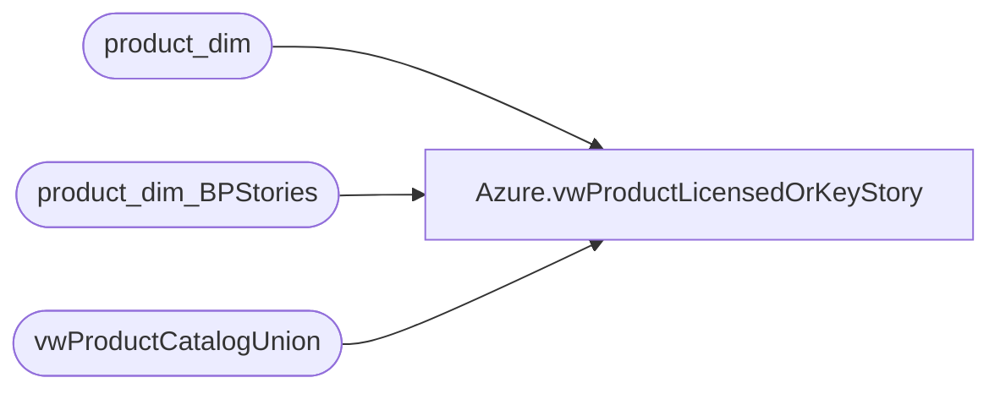

# Azure.vwProductLicensedOrKeyStory

**Database:** dw  
**Server:** papamart  

## Architecture Diagram



## Table Dependencies

| Referenced Table |
|---|
| product_dim |
| product_dim_BPStories |
| vwProductCatalogUnion |

## View Code

```sql
CREATE view [Azure].[vwProductLicensedOrKeyStory]

as


select 
	pd.product_key,
	pd.style_code,
	pd.product_desc,
	case when pa.LicensedCollection is null then 'N' else 'Y' end as Licensed,
	--pa.LicensedCollection,
	pa.KeyStory
from product_dim pd 
join vwProductCatalogUnion pa --[stl-ssis-p-01].IntegrationStaging.POS.ProductCatalogMasterAttributesStage pa 
	on pd.style_code=pa.StyleCode
	and pd.Jurisdiction_code=pa.ProductSellingGeography
where pa.LicensedCollection is not null 
or pa.KeyStory is not null
UNION
select 
	pd.product_key,
	pd.style_code,
	pd.product_desc,
	case when pa.LicensedCollection is null then 'N' else 'Y' end as Licensed,
--	pa.LicensedCollection,
	pa.KeyStory
from product_dim pd 
join vwProductCatalogUnion pa --[stl-ssis-p-01].IntegrationStaging.POS.PBIProductCatalogMasterAttributesStage pa 
	on pd.style_code=pa.StyleCode
	and pd.Jurisdiction_code=pa.ProductSellingGeography
where pa.LicensedCollection is not null
or pa.KeyStory is not null
union
select 
	pd.product_key,
	pd.style_code,
	pd.product_desc,
	bp.licensed_ind,
	bp.story
from product_dim_BPStories bp
join product_dim pd on bp.product_key=pd.product_key
where not exists (select pd.product_key 
					from product_dim pd 
					join vwProductCatalogUnion pa --[stl-ssis-p-01].IntegrationStaging.POS.ProductCatalogMasterAttributesStage pa 
						on pd.style_code=pa.StyleCode
					and pd.Jurisdiction_code=pa.ProductSellingGeography
					where pd.product_key=bp.product_key)
and not exists (select pd.product_key 
					from product_dim pd 
					join vwProductCatalogUnion pa --[stl-ssis-p-01].IntegrationStaging.POS.PBIProductCatalogMasterAttributesStage pa 
						on pd.style_code=pa.StyleCode
					and pd.Jurisdiction_code=pa.ProductSellingGeography
					where pd.product_key=bp.product_key)
```

