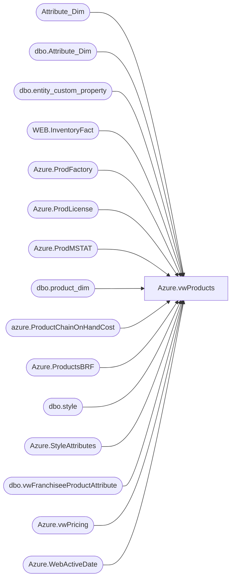

# Azure.vwProducts

**Database:** dw  
**Server:** papamart  

## Architecture Diagram



## Table Dependencies

| Referenced Table |
|---|
| Attribute_Dim |
| dbo.Attribute_Dim |
| dbo.entity_custom_property |
| WEB.InventoryFact |
| Azure.ProdFactory |
| Azure.ProdLicense |
| Azure.ProdMSTAT |
| dbo.product_dim |
| azure.ProductChainOnHandCost |
| Azure.ProductsBRF |
| dbo.style |
| Azure.StyleAttributes |
| dbo.vwFranchiseeProductAttribute |
| Azure.vwPricing |
| Azure.WebActiveDate |

## View Code

```sql
/* =============================================================================================================
 Name: [Azure].[vwProducts]

 Description: Product Dimension


 Dependencies: 

 Revision History
		Name:				Date:			Comments:
		Tim Bytnar			11/11/2015		Initial Creation
		John Eck			4/11/2019		Added Licensing and factory information
		Dan Tweedie			2019-8-24		Added CTE for ChainAverageOnHandCost  
											*/


CREATE VIEW [Azure].[vwProducts]
AS


WITH 
Attibutes AS 
	(
		SELECT        
			RIGHT(CAST('000000' AS varchar(6)) + CAST(style_code AS varchar(6)), 6) AS Style_Code, 
			AttributeName, 
			AttributeValue
        FROM  Attribute_Dim with (nolock)
        WHERE  
			AttributeName IN ('IDATE', 'ODATE', 'ONOTE', 'OUTLET', 'OMSTAT')
	), 
AttrPivot AS
    (
		SELECT        
			RIGHT(CAST('000000' AS varchar(6)) + CAST(Style_Code AS varchar(6)), 6) AS style_code, 
			CASE 
				WHEN AttributeName = 'IDATE' 
					THEN --AttributeValue 
						MIN(cast(
								case
									when isdate(replace(replace(replace(replace(AttributeValue, '\', '-'), '/', '-'), '.', '-'), ' ', '')) = 1
									then cast( replace(replace(replace(replace(AttributeValue, '\', '-'), '/', '-'), '.', '-'), ' ', '') as date)
									--else '1999-12-31'
									else NULL
								end
						as date))
				ELSE NULL 
			END AS IDATE, 
            CASE 
				WHEN AttributeName = 'ODATE' 
					THEN --AttributeValue 
					MAX(cast(
								case
									when isdate(replace(replace(replace(replace(AttributeValue, '\', '-'), '/', '-'), '.', '-'), ' ', '')) = 1
									then cast( replace(replace(replace(replace(AttributeValue, '\', '-'), '/', '-'), '.', '-'), ' ', '') as date)
									--else '1999-12-31'
									else NULL
								end
						as date))
				ELSE NULL 
			END AS ODATE, 
			CASE 
				WHEN AttributeName = 'ONOTE' 
					THEN AttributeValue 
				ELSE NULL 
			END AS ONOTE, 
            CASE 
				WHEN AttributeName = 'OUTLET' 
					THEN AttributeValue 
				ELSE NULL 
			END AS OUTLET, 
			CASE 
				WHEN AttributeName = 'OMSTAT' 
					THEN AttributeValue 
				ELSE NULL 
			END AS OMSTAT
		FROM Attibutes
		group by 
			RIGHT(CAST('000000' AS varchar(6)) + CAST(Style_Code AS varchar(6)), 6),
			AttributeName,
			AttributeValue
	), 
MaxAttr AS
    (
		SELECT        
			RIGHT(CAST('000000' AS varchar(6)) + CAST(style_code AS varchar(6)), 6) AS style_code, 
			MIN(IDATE) AS IDATE, 
			MAX(ODATE) AS ODATE, 
			MAX(ONOTE) AS ONOTE, 
			MAX(OUTLET) AS OUTLET, 
			MAX(OMSTAT) AS OMSTAT
		FROM  AttrPivot
		--where isnull(ODATE, getdate()) <= getdate()
		GROUP BY style_code
	), 
FilteredKeystories AS
    (
		SELECT
			CAST(style_code AS varchar(10)) AS Style_Code, 
			MIN(AttributeValue) AS KeyStory
		FROM  dbo.Attribute_Dim
		WHERE  AttributeName = 'KEYSTY'
		GROUP BY style_code
	), 
KeyStories AS
    (
		SELECT        
			s.style_code, 
			MAX(ecp.custom_property_value) AS KeyStory
      FROM            
		BEDROCKDB02.me_01.dbo.style AS s 
		LEFT OUTER JOIN BEDROCKDB02.me_01.dbo.entity_custom_property AS ecp 
			ON s.style_id = ecp.parent_id 
				AND ecp.parent_type = 1 
				AND ecp.custom_property_id = 60
      GROUP BY s.style_code
	 ),
--unitCost AS
--     (
--              SELECT 
--                     ProductKey,
--                     case when sum(OnHand) = 0 then 0 else round(sum(OnHandcost)/sum(Onhand),2) end as ChainAverageOnHandCost
--              FROM   
--                     azure.OnHand
--                     join azure.NewDateDim 
--                           on workyear = right(Fiscal_Year,4) 
--                                  and workWeek = Cast(Fiscal_Week_Of_Year_key as int) 
--                                  and Fiscal_Day_Of_Week_key = 1
--								  and datediff(dd, date_key, getdate()) <=7 --tries to get most recent week only
--              WHERE inv_status = 'Available' 
--              GROUP BY ProductKey

--       )
unitCost as
	(
		select 
			ProductKey,
			ChainAverageOnHandCost,
			ChainAverageOnHandCostGBP
		from azure.ProductChainOnHandCost  -->> this table is loaded nightly at 1am via stl-ssis-p-01 sql agent UKLoyaltyLoad --> job does other ETLs then loads this table via [Azure].[spProductChainAverageOnHandCost]
	),
webInventory as
	(
  --       select 
		--      LocationCode,
		--	  StyleCode,
		--	  UnbufferedQty  
		--from [stl-ssis-p-01].IntegrationStaging.WEB.InventoryFact where LocationCode in ( '0013', '2013')
		
	select 
			  StyleCode,
			  max(UnbufferedQty) as 'UnbufferedQty'
		from [stl-ssis-p-01].IntegrationStaging.WEB.InventoryFact 
		where LocationCode in ( '0013', '2013')
		group by StyleCode
    )
SELECT        
	pd.product_key AS ProductKey, 
	pd.style_code AS Style, 
	ISNULL(pd.style_desc, pd.product_desc) AS StyleDescription, 
	pd.color_desc AS Color, 
	pd.Concept, 
	pd.Chain, 
	pd.Division, 
	pd.Department, 
	pd.Class, 
	pd.SubClass, 
    pd.department_code AS DeptCode, 
	pd.subclass_code AS SubClassCode, 
	pd.ScorecardCategory, 
	pd.primary_vendor_code AS PrimaryVendorCode, 
	pd.primary_vendor_name AS PrimaryVendorName, 
    pd.alt_primary_vendor_code AS AltPrimaryVendorCode, 
	pd.current_retail AS CurrentRetail, 
	pd.original_retail AS OriginalRetail, 
	pd.current_selling_retail_home AS CurrentSellingRetailHome, 
	pd.price_with_vat AS PriceWithVat, 
    pd.euro_value AS EuroValue, 
	pd.cdn_value AS CanValue, 
	pd.merch_status AS MerchStatus, 
	pd.jurisdiction_code AS JurisdictionCode, 
	pd.Gender, 
	pd.CORE_FASH_CD AS CoreFashCode, 
	pd.INLINE_CD AS InlineCode, 
    CAST(pd.activation_date AS date) AS ActivationDate, 
	KeyStories.KeyStory, 
	ma.IDATE, 
	ma.ODATE, 
	ma.ONOTE, 
	ma.OUTLET, 
	ma.OMSTAT, 
	ISNULL(CA.AU_CustomAttribute1, KeyStories.KeyStory) AS altKeyStory, 
    P.Current_Selling_Retail AS HomeCurrentRetail, 
	P.Original_Selling_Retail AS HomeOriginalRetail, 
	P.IE_Current_Retail AS IECurrentRetail, 
	P.IE_Original_Retail AS IEOriginalRetail, 
	P.DK_Current_Retail AS DKCurrentRetail, 
    P.DK_Original_Retail AS DKOriginalRetail, 
	b01.LicenseCode, 
	b01.LicenseDescription, 
	b02.FactoryCode, 
	b02.FactoryName, 
	b01.Primary_Vendor_Cur_Cost, 
	b04.MSTAT, 0 AS BufferQTY, 
	WA.WebActiveDate, 
	SA.RoyaltyStyle, 
    SA.WebStatus, 
	SA.WholeSaleStatus,
	isnull(UC.ChainAverageOnHandCost,0) as ChainAverageOnHandCost,
	isnull(UC.ChainAverageOnHandCostGBP,0) as ChainAverageOnHandCostGBP,
	isnull(brf.isBRFstyle,0) as isBRFstyle,
	isnull(wi.UnbufferedQty,0) as WebInventory
FROM  dbo.product_dim AS pd WITH (nolock) 
left join MaxAttr AS ma ON pd.style_code = ma.style_code 
left join FilteredKeystories AS fk ON pd.style_code = fk.Style_Code 
left join dbo.vwFranchiseeProductAttribute AS CA ON pd.style_code = CA.StyleCode 
left join KeyStories ON pd.style_code = KeyStories.style_code 
left join Azure.vwPricing AS P ON pd.product_key = P.ProductKey 
left join Azure.ProdLicense AS b01 ON pd.product_key = b01.ProductKey 
left join Azure.ProdFactory AS b02 ON pd.product_key = b02.ProductKey 
left join Azure.ProdMSTAT AS b04 ON pd.product_key = b04.ProductKey 
left join Azure.WebActiveDate AS WA ON pd.style_code = WA.Style 
left join Azure.StyleAttributes AS SA ON pd.style_code = SA.StyleCode
left join unitCost as UC ON pd.product_key = UC.ProductKey
left join Azure.ProductsBRF brf on pd.product_key = brf.ProductKey
left join webInventory wi on wi.StyleCode = pd.style_code

WHERE   
	pd.style_code IS NOT NULL 
	AND pd.style_code <> 'N/A'
```

