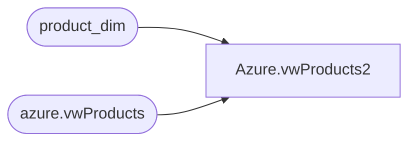

# Azure.vwProducts2

**Database:** dw  
**Server:** papamart  

## Architecture Diagram



## Table Dependencies

| Referenced Table |
|---|
| product_dim |
| azure.vwProducts |

## View Code

```sql
CREATE VIEW [Azure].[vwProducts2]
AS


select pd.ProductKey,pd.KeyStory,pd.Chain as ConsumerGroup,	pd.Department, case when len(LicenseCode) > 1  then 1 else 0 end as LicensedOrNot, pd.Style, pd.Chain, pd.LicenseCode from azure.vwProducts pd with (nolock)	
union
select product_key as ProductKey, CAST(UPPER(REPLACE(REPLACE(product_desc,' ',''),'-','')) as nvarchar(30))  as KeyStory, 'Babw' as ConsumerGroup, department as Department,
--0 as LicensedOrNot, style_code as Style, 'Babw' as Chain, ' ' as LicenseCode from product_dim where product_key < 1
0 as LicensedOrNot, product_key as Style, 'Babw' as Chain, ' ' as LicenseCode from product_dim where product_key < 1
```

