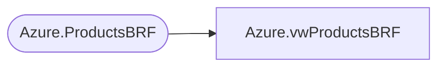

# Azure.vwProductsBRF

**Database:** dw  
**Server:** papamart  

## Architecture Diagram



## Table Dependencies

| Referenced Table |
|---|
| Azure.ProductsBRF |

## View Code

```sql
CREATE VIEW [Azure].[vwProductsBRF]
AS


select [ProductKey],
	[Style]
	from [Azure].[ProductsBRF]

--from [Azure].[vwProducts] where [Style] in
--(
--SELECT a.style_code 
--FROM bedrockdb02.ma_01.dbo.style a, bedrockdb02.ma_01.dbo.view_style_attribute_outer b01
--where b01.attribute_set_code = 'BRF'
--)
```

