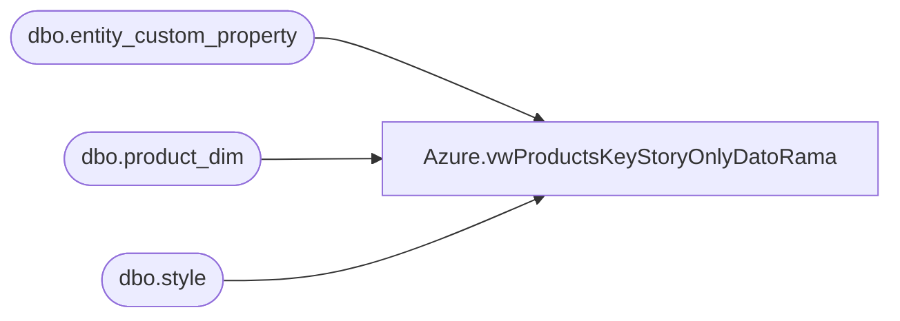

# Azure.vwProductsKeyStoryOnlyDatoRama

**Database:** dw  
**Server:** papamart  

## Architecture Diagram



## Table Dependencies

| Referenced Table |
|---|
| dbo.entity_custom_property |
| dbo.product_dim |
| dbo.style |

## View Code

```sql
CREATE VIEW [Azure].[vwProductsKeyStoryOnlyDatoRama]
AS

-- Created View on 4/27/2023 -- Tim Callahan  -- Poor performance from  [Azure].[vwProducts]

with 
KeyStories AS
    (
		SELECT        
			s.style_code, 
			MAX(ecp.custom_property_value) AS KeyStory
      FROM            
		BEDROCKDB02.me_01.dbo.style AS s 
		LEFT OUTER JOIN BEDROCKDB02.me_01.dbo.entity_custom_property AS ecp 
			ON s.style_id = ecp.parent_id 
				AND ecp.parent_type = 1 
				AND ecp.custom_property_id = 60
      GROUP BY s.style_code
	 )
	 
select 
pd.style_code AS Style, 
pd.jurisdiction_code AS JurisdictionCode, 
KeyStories.KeyStory, 
pd.department_code AS DeptCode
FROM  dbo.product_dim AS pd WITH (nolock) 
left join KeyStories ON pd.style_code = KeyStories.style_code 
WHERE   1 =1 
AND pd.style_code IS NOT NULL 
AND pd.style_code <> 'N/A'
```

