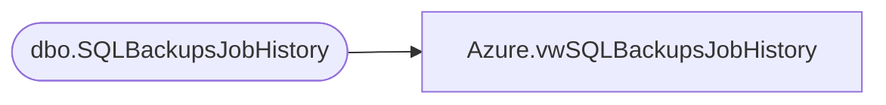

# Azure.vwSQLBackupsJobHistory

**Database:** dw  
**Server:** papamart  

## Architecture Diagram



## Table Dependencies

| Referenced Table |
|---|
| dbo.SQLBackupsJobHistory |

## View Code

```sql
CREATE view [Azure].[vwSQLBackupsJobHistory]

as

select 
	ServerName,
	JobName,	
	case 
		when JobName like '%user%' 
			and JobName not like '%System and User%'
			then 'User'
		when JobName like '%system%' 
			and JobName not like '%System and User%'
			then 'System'
		when JobName like '%System and User%'
			then 'System and User'
	end as DatabaseType,
	BackupLocation,	
	NextRunDate,	
	LastRunDate,	
	LastRunStatus,	
	LastRunDuration	
from [stl-ssis-p-01].IntegrationStaging.dbo.SQLBackupsJobHistory
```

