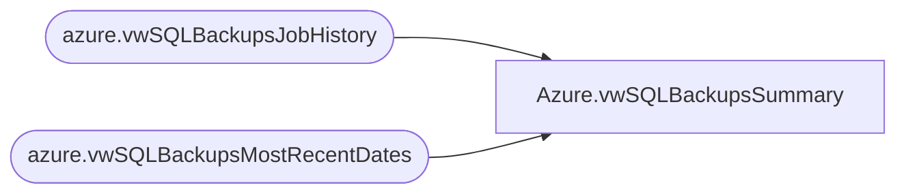

# Azure.vwSQLBackupsSummary

**Database:** dw  
**Server:** papamart  

## Architecture Diagram



## Table Dependencies

| Referenced Table |
|---|
| azure.vwSQLBackupsJobHistory |
| azure.vwSQLBackupsMostRecentDates |

## View Code

```sql
CREATE view [Azure].[vwSQLBackupsSummary]

as


select 
	d.ServerName,
	d.DatabaseName,
	d.DatabaseType,
	isnull(jf.BackupLocation, jd.BackupLocation) BackupLocation,
	d.FullBackupDate,
	d.DifferentialBackupDate,	
	jf.JobName FullJobName,
	jf.NextRunDate FullNextRunDate,	
	jf.LastRunDate FullLastRunDate,	
	jf.LastRunStatus FullLastRunStatus,	
	jf.LastRunDuration FullLastRunDuration,
	jd.JobName DiffJobName,	
	jd.NextRunDate DiffNextRunDate,	
	jd.LastRunDate DiffLastRunDate,	
	jd.LastRunStatus DiffLastRunStatus,	
	jd.LastRunDuration DiffLastRunDuration,
	datediff(dd, d.FullBackupDate,getdate()) DaysSinceLastFullBackup,
	datediff(dd, d.DifferentialBackupDate, getdate()) DaysSinceLastDiffBackup,
	d.SQLServerServiceAccount,
	d.SQLAgentServerAccount
from azure.vwSQLBackupsMostRecentDates d 
left join azure.vwSQLBackupsJobHistory jf
	on jf.ServerName=d.ServerName
	and (jf.DatabaseType=d.DatabaseType or jf.DatabaseType='System and User')
	and jf.JobName like '%full%'
left join azure.vwSQLBackupsJobHistory jd
	on jd.ServerName=d.ServerName
	and (jd.DatabaseType=d.DatabaseType or jd.DatabaseType='System and User')
	and jd.JobName like '%diff%'
```

