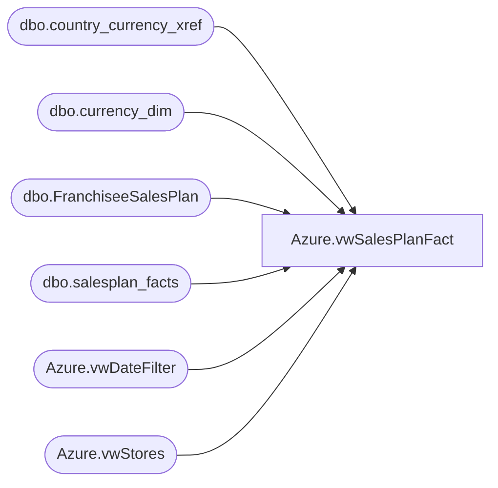

# Azure.vwSalesPlanFact

**Database:** dw  
**Server:** papamart  

## Architecture Diagram



## Table Dependencies

| Referenced Table |
|---|
| dbo.country_currency_xref |
| dbo.currency_dim |
| dbo.FranchiseeSalesPlan |
| dbo.salesplan_facts |
| Azure.vwDateFilter |
| Azure.vwStores |

## View Code

```sql
CREATE VIEW [Azure].[vwSalesPlanFact]
AS
SELECT CAST(ds.StoreID AS VARCHAR) AS StoreKey
	, dd.Actual_Date AS CalendarDate
	, cd.currency_code AS CurrencyCode
	, spf.amount AS SalesPlan
FROM DW.dbo.salesplan_facts spf
INNER JOIN DW.Azure.vwStores ds
	ON ds.StoreKey=CAST(spf.store_key AS VARCHAR)
INNER JOIN Azure.vwDateFilter dd
	ON dd.date_key=spf.date_key 
INNER JOIN DW.dbo.currency_dim cd
	ON cd.currency_key=spf.currency_key
WHERE spf.amount <> 0

UNION ALL

SELECT  ds.StoreKey AS StoreKey
	   ,dd.actual_date AS CalendarDate
	   ,cd.currency_code AS CurrencyCode
	   ,fsp.PlannedSales/7 AS SalesPlan
FROM DW.dbo.FranchiseeSalesPlan fsp
INNER JOIN DW.Azure.vwStores ds
	ON ds.StoreID=fsp.StoreID
INNER JOIN Azure.vwDateFilter dd
	ON dd.fiscal_year=fsp.FiscalYear
	AND dd.fiscal_week=fsp.FiscalWeek
INNER JOIN DW.dbo.country_currency_xref cc
	ON cc.country_code=fsp.Franchisee
INNER JOIN DW.dbo.currency_dim cd
	ON cd.currency_key=cc.currency_key
```

