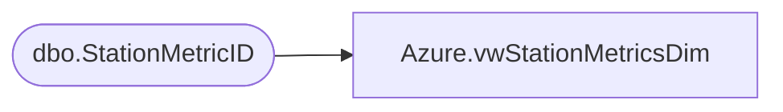

# Azure.vwStationMetricsDim

**Database:** dw  
**Server:** papamart  

## Architecture Diagram



## Table Dependencies

| Referenced Table |
|---|
| dbo.StationMetricID |

## View Code

```sql
create VIEW [Azure].[vwStationMetricsDim] AS
-- =============================================================================================================
-- Name: [Azure].[vwStationMetricsFact
--Name me and hear me station data
--
--
-- Dependencies: 
--
-- Revision History
--		Name:				Date:			Comments:
--		John Eck		9/9/2018		Initial creation
--
-- =============================================================================================================
select MetricID,MetricIdKey,EventType,MetricDescription


from Kodiak.BABW_Interactive_Metric.dbo.StationMetricID
```

