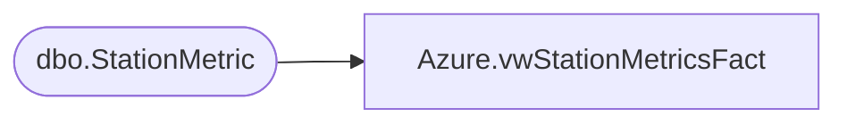

# Azure.vwStationMetricsFact

**Database:** dw  
**Server:** papamart  

## Architecture Diagram



## Table Dependencies

| Referenced Table |
|---|
| dbo.StationMetric |

## View Code

```sql
CREATE VIEW [Azure].[vwStationMetricsFact] AS
-- =============================================================================================================
-- Name: [Azure].[vwStationMetricsFact
--Name me and hear me station data
--
--
-- Dependencies: 
--
-- Revision History
--		Name:				Date:			Comments:
--		John Eck		9/9/2018		Initial creation
--
-- =============================================================================================================
select rowIndex , storeDBRowIndex,StoreNumber as StoreKey , StationIP, MetricID,  IsNumeric(MetricValue ) as MetricValue, Cast(MetricDateTime as Date) as DateKey,
MetricHour , MetricDateTime 

from Kodiak.BABW_Interactive_Metric.dbo.StationMetric
where metricDateTime > = GetDate() -60
```

