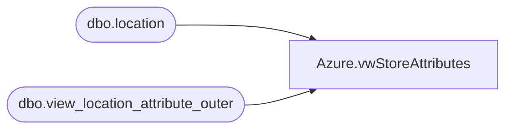

# Azure.vwStoreAttributes

**Database:** dw  
**Server:** papamart  

## Architecture Diagram



## Table Dependencies

| Referenced Table |
|---|
| dbo.location |
| dbo.view_location_attribute_outer |

## View Code

```sql
CREATE VIEW [Azure].[vwStoreAttributes] AS
-- =============================================================================================================
-- Name: [Azure].[vwStoreAttributes]
--
-- Description: Merchandising attributes for locations
--
--
-- Dependencies: 
--
-- Revision History
--		Name:				Date:			Comments:
--		John Eck			12/12/2018		Initial Creation
-- =============================================================================================================
-- Corporate Stores
SELECT DISTINCT a.location_code as StoreNumber,
 b01.attribute_set_code as DCSource, 
 b02.attribute_set_code as DistroDay, b03.attribute_set_code as DeliveryDay, b04.attribute_set_code as SoundStore, 
 b05.attribute_set_code as StoreConcept, b06.attribute_set_code as FocusFifty, b07.attribute_set_code as LocationType, 
 a.location_id as LocationID
FROM bedrockdb02.ma_01.dbo.location a, bedrockdb02.ma_01.dbo.view_location_attribute_outer b01, 
  (Select Location_ID,max(attribute_set_code)  attribute_set_code from bedrockdb02.ma_01.dbo.view_location_attribute_outer
    where attribute_ID = 19 group by location_ID) b03
, bedrockdb02.ma_01.dbo.view_location_attribute_outer b02, 
bedrockdb02.ma_01.dbo.view_location_attribute_outer b04, bedrockdb02.ma_01.dbo.view_location_attribute_outer b05, 
bedrockdb02.ma_01.dbo.view_location_attribute_outer b06, bedrockdb02.ma_01.dbo.view_location_attribute_outer b07 
WHERE a.location_id = b01.location_id  and b01.attribute_id = 17 
    AND a.location_id = b02.location_id  and b02.attribute_id = 18
    AND a.location_id = b03.location_id   
    AND a.location_id = b04.location_id  and b04.attribute_id = 507 
    AND a.location_id = b05.location_id  and b05.attribute_id = 588 
    AND a.location_id = b06.location_id  and b06.attribute_id = 685 
    AND a.location_id = b07.location_id  and b07.attribute_id = 702
```

