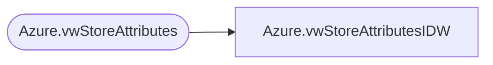

# Azure.vwStoreAttributesIDW

**Database:** dw  
**Server:** papamart  

## Architecture Diagram



## Table Dependencies

| Referenced Table |
|---|
| Azure.vwStoreAttributes |

## View Code

```sql
CREATE VIEW [Azure].[vwStoreAttributesIDW] AS


SELECT [StoreNumber]
      ,case when  StoreNumber < '0900' then 1000 + StoreNumber else StoreNumber end as StoreNumberD365
      ,[DCSource]
      ,[DistroDay]
      ,[DeliveryDay]
      ,[SoundStore]
      ,[StoreConcept]
      ,[FocusFifty]
      ,[LocationType]
      ,[LocationID]
  FROM [Azure].[vwStoreAttributes]
```

