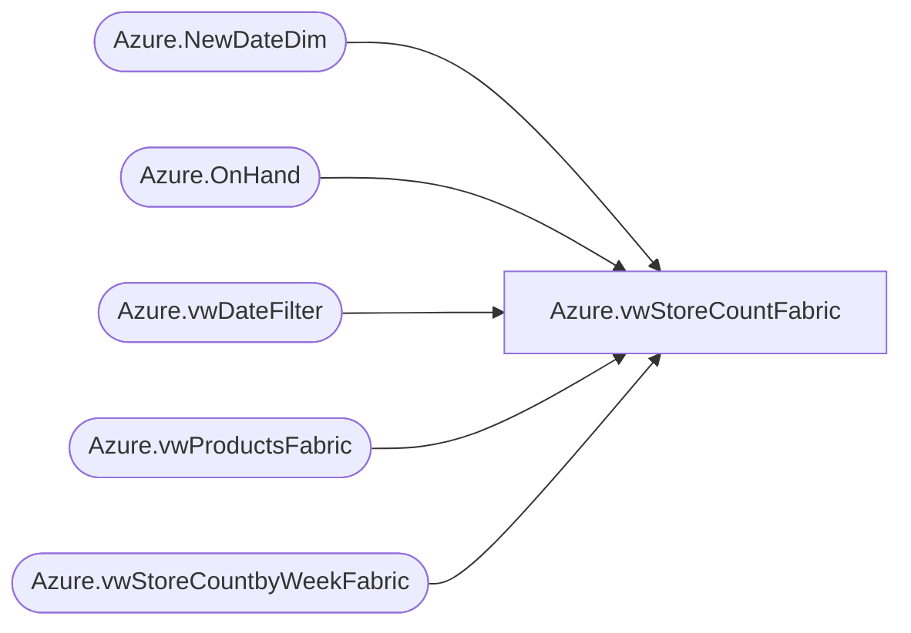

# Azure.vwStoreCountFabric

**Database:** dw  
**Server:** papamart  

## Architecture Diagram



## Table Dependencies

| Referenced Table |
|---|
| Azure.NewDateDim |
| Azure.OnHand |
| Azure.vwDateFilter |
| Azure.vwProductsFabric |
| Azure.vwStoreCountbyWeekFabric |

## View Code

```sql
CREATE VIEW [Azure].[vwStoreCountFabric]
AS
WITH 
P AS 
	(
		SELECT        
			ProductKey, 
			CASE LEFT(style, 1) 
				WHEN 0 THEN 'NA' 
				WHEN '1' THEN 'CA' 
				WHEN '4' THEN 'EU' 
				WHEN '8' THEN 'AS' 
			END AS Jurisdiction
        FROM Azure.vwProductsFabric 
	), 
d AS
    (
		SELECT
			Azure.OnHand.ProductKey, 
			Azure.OnHand.workYear, 
			Azure.OnHand.workweek, 
			SUM(Azure.OnHand.OnHandCost) AS Cost, 
			SUM(Azure.OnHand.OnHand) AS Units, 
			Azure.NewDateDim.Date_Key
      FROM Azure.OnHand 
	  INNER JOIN Azure.NewDateDim 
		ON Azure.OnHand.workYear = RIGHT(Azure.NewDateDim.Fiscal_Year, 4) 
		AND Azure.OnHand.workweek = CAST(Azure.NewDateDim.Fiscal_Week_Of_Year_key AS int) 
		AND Azure.NewDateDim.Fiscal_Day_Of_Week_Key = 1
      WHERE (Azure.OnHand.Inv_Status = 'Available')
      GROUP BY 
		Azure.OnHand.ProductKey, 
		Azure.OnHand.workYear, 
		Azure.OnHand.workweek, 
		Azure.NewDateDim.Date_Key

	),
PreStage as 
	(
		SELECT        
			P_1.ProductKey, 
			cast(C.actual_date as date) AS ActualDate, 
			C.store_count AS StoreCount, 
			isnull(d_1.Cost / nullif(d_1.Units, 0),0) AS UnitCost
		 FROM  P AS P_1 
		 INNER JOIN Azure.vwStoreCountbyWeekFabric AS C ON P_1.Jurisdiction = C.TradingGroup 
		 INNER JOIN Azure.vwDateFilter AS f ON C.actual_date = f.actual_date 
		 LEFT OUTER JOIN d AS d_1 
			ON P_1.ProductKey = d_1.ProductKey 
			AND f.actual_date = d_1.Date_Key
	)
select *
from PreStage
```

