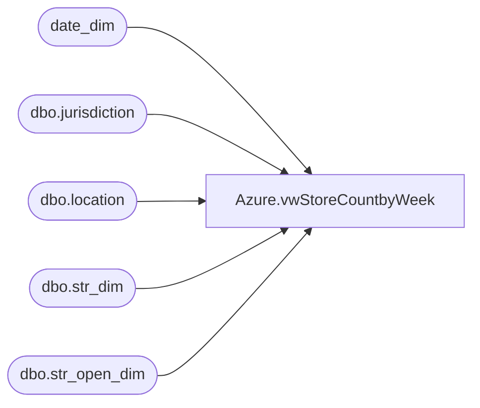

# Azure.vwStoreCountbyWeek

**Database:** dw  
**Server:** papamart  

## Architecture Diagram



## Table Dependencies

| Referenced Table |
|---|
| date_dim |
| dbo.jurisdiction |
| dbo.location |
| dbo.str_dim |
| dbo.str_open_dim |

## View Code

```sql
CREATE view [Azure].[vwStoreCountbyWeek]

as
-- =============================================================================================================
-- Name: [Azure].[vwStoreCount]
--
-- Description: Warehouse InventoryCount of Stores Open by week by Jurisdiction
--
-- Dependencies: 
--
-- Revision History
--		Name:				Date:			Comments:
--		John Eck			12/19/2018		Initial Creation

--											
-- =============================================================================================================
select 
	case 
		when j.jurisdiction_code in ('HOME', 'US') then 'NA'
		when j.jurisdiction_code in ('CA') then 'CA'
		when j.jurisdiction_code in ('DK', 'IE', 'UK') then 'EU'
		when j.jurisdiction_code in ('CN') then 'AS'
	end as TradingGroup,
	count(sd.str_id) store_count,
	actual_date

from 
	kodiak.babwmstrdata.dbo.str_dim sd with (nolock)
join kodiak.babwmstrdata.dbo.str_open_dim sod with (nolock) on sd.str_id = sod.str_key
join bedrockdb02.ma_01.dbo.location l with (nolock) on cast(sd.str_num as int) = cast(l.location_code as int)
join bedrockdb02.ma_01.dbo.jurisdiction j with (nolock) on l.jurisdiction_id = j.jurisdiction_id
inner join date_dim on  (cast(sod.open_dt as date) <= Actual_date and ISNULL(cast(sod.close_dt as date),'12/31/35') >= Actual_Date)
Where DatePart("dw",actual_Date) =  1 
group by 
	case 
		when j.jurisdiction_code in ('HOME', 'US') then 'NA'
		when j.jurisdiction_code in ('CA') then 'CA'
		when j.jurisdiction_code in ('DK', 'IE', 'UK') then 'EU'
		when j.jurisdiction_code in ('CN') then 'AS'
	end,
	actual_Date
```

