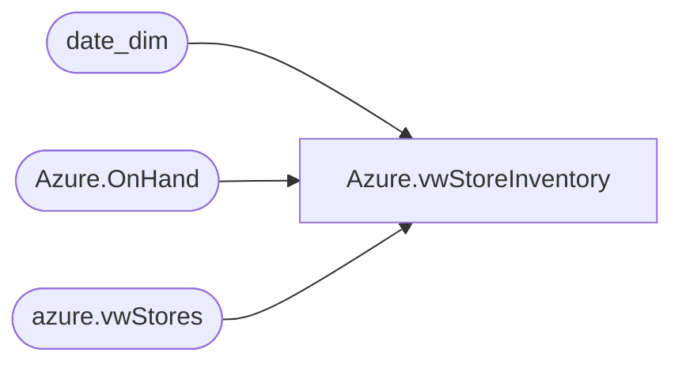

# Azure.vwStoreInventory

**Database:** dw  
**Server:** papamart  

## Architecture Diagram



## Table Dependencies

| Referenced Table |
|---|
| date_dim |
| Azure.OnHand |
| azure.vwStores |

## View Code

```sql
CREATE view [Azure].[vwStoreInventory]

as
-- =============================================================================================================
-- Name: [Azure].[vwStoreInventory]
--
-- Description: Store Inventory
--
--
-- Dependencies: 
--
-- Revision History
--		Name:				Date:			Comments:
--		John Eck			12/19/2018		Initial Creation

--											
-- =============================================================================================================
With D as 
	(
		Select 
			Actual_date,
			fiscal_week,
			fiscal_year 
		from date_dim 
		where datepart(dw,actual_date) = 1
	)
select 
	O.StoreKey,
	ProductKey,
	OnHand,
	WorkYear,
	WorkWeek,
	Case Inv_Status 
		when 'Available' then 
			s.LocationType 
			Else 'Store' 
	End + ' ' + Inv_Status AS Inv_Status

,  cast(Actual_date as date) as DateKey 
from Azure.OnHand o 
inner join azure.vwStores S on O.storeKey = s.storeKey
inner join d on (fiscal_year = workYear and fiscal_week = Workweek)
where s.LocationType in ('Web','Chain','Outlet')
union all 
select 1,33789,171,2019,'13','Store Allocated', cast('2018-05-06 00:00:00.000' as date)
union all 
select 1,33789,171,2019,'13','Store Damaged',cast('2018-05-06 00:00:00.000' as date)
union all 
select 1,33789,171,2019,'13','Store Reserved Cust Order',cast('2018-05-06 00:00:00.000' as date)
union all 
select 1,33789,171,2019,'13','Store Pending Shrink',cast('2018-05-06 00:00:00.000' as date)
union all 
select 1,33789,1,2024,'49','OUTLET Available',cast('2018-05-06 00:00:00.000' as date)
```

