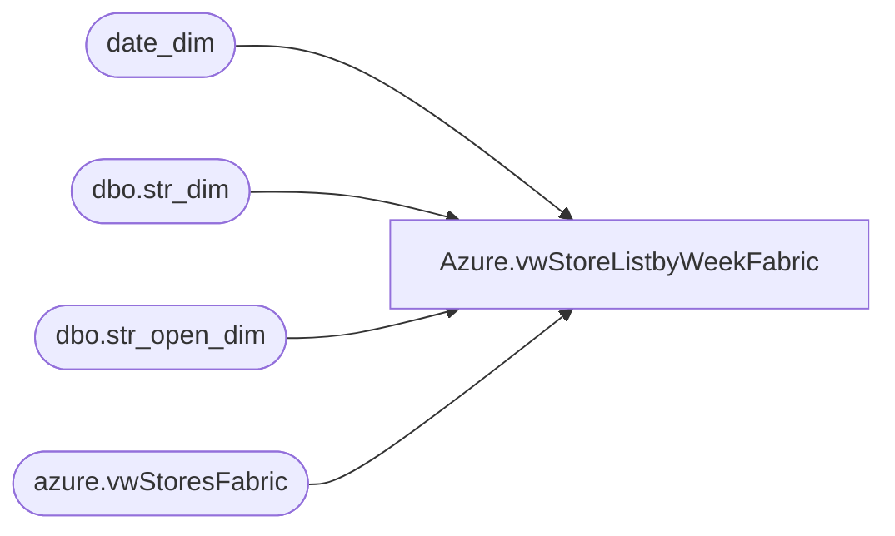

# Azure.vwStoreListbyWeekFabric

**Database:** dw  
**Server:** papamart  

## Architecture Diagram



## Table Dependencies

| Referenced Table |
|---|
| date_dim |
| dbo.str_dim |
| dbo.str_open_dim |
| azure.vwStoresFabric |

## View Code

```sql
CREATE view [Azure].[vwStoreListbyWeekFabric]

as
-- =============================================================================================================
-- Name: [Azure].[vwStoreListByWeek]
--
-- Description: Warehouse InventoryCount of Stores Open by week by Jurisdiction
--
-- =============================================================================================================
select 
	case 
		when s.CountryNameAbbr in ('US') then 'NA'
		when s.CountryNameAbbr in ('CA') then 'CA'
		when s.CountryNameAbbr in ('DK', 'IE', 'UK') then 'EU'
		when s.CountryNameAbbr in ('CN') then 'AS'
	end as TradingGroup,
	case 
		when s.CountryNameAbbr in ('US') then '0'
		when s.CountryNameAbbr in ('CA') then '1'
		when s.CountryNameAbbr in ('DK', 'IE', 'UK') then '4'
		when s.CountryNameAbbr in ('CN') then '8'
	end as StyleCode,
	StoreKey,
	actual_date,CountryNameAbbr

from 
	kodiak.babwmstrdata.dbo.str_dim sd with (nolock)
join kodiak.babwmstrdata.dbo.str_open_dim sod with (nolock) on sd.str_id = sod.str_key
inner join date_dim on  (cast(sod.open_dt as date) <= Actual_date and ISNULL(cast(sod.close_dt as date),'12/31/35') >= Actual_Date)
Inner join azure.vwStoresFabric s on right('000' + Cast(sd.str_num as varchar(10)),4) = storeNumber
Where DatePart("dw",actual_Date) =  1
```

