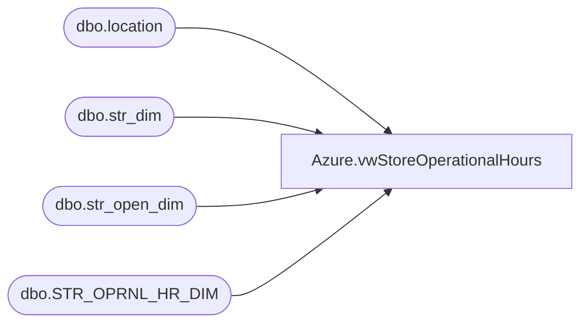

# Azure.vwStoreOperationalHours

**Database:** dw  
**Server:** papamart  

## Architecture Diagram



## Table Dependencies

| Referenced Table |
|---|
| dbo.location |
| dbo.str_dim |
| dbo.str_open_dim |
| dbo.STR_OPRNL_HR_DIM |

## View Code

```sql
CREATE VIEW [Azure].[vwStoreOperationalHours]
AS


select
	l.location_code,
	l.gl_location_number,
	max(case when dy_of_wk_id= 1 then Right(CONVERT(VARCHAR,STRT_TM,100),7) else null end) as SundayOpen,
	max(case when dy_of_wk_id= 2 then Right(CONVERT(VARCHAR,STRT_TM,100),7) else null end) as MondayOpen,
	max(case when dy_of_wk_id= 3 then Right(CONVERT(VARCHAR,STRT_TM,100),7) else null end) as TuesdayOpen,
	max(case when dy_of_wk_id= 4 then Right(CONVERT(VARCHAR,STRT_TM,100),7) else null end) as WednesdayOpen,
	max(case when dy_of_wk_id= 5 then Right(CONVERT(VARCHAR,STRT_TM,100),7) else null end) as ThursdayOpen,
	max(case when dy_of_wk_id= 6 then Right(CONVERT(VARCHAR,STRT_TM,100),7) else null end) as FridayOpen,
	max(case when dy_of_wk_id= 7 then Right(CONVERT(VARCHAR,STRT_TM,100),7) else null end) as SaturdayOpen,
	max(case when dy_of_wk_id= 1 then Right(CONVERT(VARCHAR,END_TM,100),7) else null end) as SundayClosed,
	max(case when dy_of_wk_id= 2 then Right(CONVERT(VARCHAR,END_TM,100),7) else null end) as MondayClosed,
	max(case when dy_of_wk_id= 3 then Right(CONVERT(VARCHAR,END_TM,100),7) else null end) as TuesdayClosed,
	max(case when dy_of_wk_id= 4 then Right(CONVERT(VARCHAR,END_TM,100),7) else null end) as WednesdayClosed,
	max(case when dy_of_wk_id= 5 then Right(CONVERT(VARCHAR,END_TM,100),7) else null end) as ThursdayClosed,
	max(case when dy_of_wk_id= 6 then Right(CONVERT(VARCHAR,END_TM,100),7) else null end) as FridayClosed,
	max(case when dy_of_wk_id= 7 then Right(CONVERT(VARCHAR,END_TM,100),7) else null end) as SaturdayClosed
FROM kodiak.BABWMstrData.dbo.STR_OPRNL_HR_DIM  h (NOLOCK)
join kodiak.BABWMstrData.dbo.str_dim sd on h.str_id=sd.str_id 
join kodiak.BABWMstrData.dbo.str_open_dim sod on sd.str_id = sod.str_key
join bedrockdb02.me_01.dbo.location l on sd.str_num=l.location_code
where h.STR_ID<>-1
and cast(sod.open_dt as date) <= cast(getdate() as date)
and (cast(sod.close_dt as date) > cast(getdate() as date) or sod.close_dt is null)
group by 
	l.location_code,
	l.gl_location_number
--order by l.gl_location_number
```

