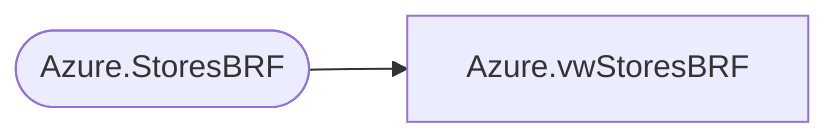

# Azure.vwStoresBRF

**Database:** dw  
**Server:** papamart  

## Architecture Diagram



## Table Dependencies

| Referenced Table |
|---|
| Azure.StoresBRF |

## View Code

```sql
CREATE VIEW [Azure].[vwStoresBRF] AS


select [StoreID],
	[StoreNumber],
	[StoreKey],
	[StoreNameAbbr]
	from [Azure].[StoresBRF]
--	from [Azure].[vwStores]
--where StoreNumber in 
--(

--select distinct location_code --, location_name
--from bedrockdb02.ma_01.dbo.view_location_attribute_outer v
--join bedrockdb02.ma_01.dbo.location l on l.location_id = v.location_id
--where v.attribute_set_code = 'BCKFIL'
--)
```

