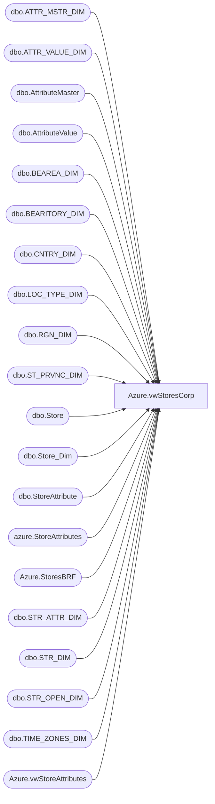

# Azure.vwStoresCorp

**Database:** dw  
**Server:** papamart  

## Architecture Diagram



## Table Dependencies

| Referenced Table |
|---|
| dbo.ATTR_MSTR_DIM |
| dbo.ATTR_VALUE_DIM |
| dbo.AttributeMaster |
| dbo.AttributeValue |
| dbo.BEAREA_DIM |
| dbo.BEARITORY_DIM |
| dbo.CNTRY_DIM |
| dbo.LOC_TYPE_DIM |
| dbo.RGN_DIM |
| dbo.ST_PRVNC_DIM |
| dbo.Store |
| dbo.Store_Dim |
| dbo.StoreAttribute |
| azure.StoreAttributes |
| Azure.StoresBRF |
| dbo.STR_ATTR_DIM |
| dbo.STR_DIM |
| dbo.STR_OPEN_DIM |
| dbo.TIME_ZONES_DIM |
| Azure.vwStoreAttributes |

## View Code

```sql
create view azure.vwStoresCorp

as 

-- Corporate Stores
WITH PermCloseStores (StoreKey) AS (
	SELECT	DISTINCT STR_KEY
	FROM	KODIAK.BABWMstrData.dbo.STR_OPEN_DIM
	WHERE	PERM_CLOSE=1
	),
CloseDates AS (
	select str_key,max(Open_dt) as Op ,Max(close_dt) as cl from KODIAK.BABWMstrData.dbo.STR_OPEN_DIM group by str_key)
,	
FranchiseeStoreDesign as
(
SELECT	
s.franchID,
CAST(s.Code AS VARCHAR) StoreNumber,
a.SystemKeyword as StoreDesign
FROM KODIAK.FranchMstrData.dbo.StoreAttribute sa with (nolock)
join KODIAK.FranchMstrData.dbo.Store s with (nolock) ON s.storeID=sa.storeID
join KODIAK.FranchMstrData.dbo.AttributeValue a with (nolock) on sa.attributeValueID = a.attributeValueID
join KODIAK.FranchMstrData.dbo.AttributeMaster am with (nolock) on a.attributeMasterID = am.attributeMasterID
where am.Title = 'Store Design'
and sa.startDate <= getdate()
and isnull(sa.EndDate, getdate()) >= getdate()
--order by StoreNumber asc
),
USstoreDesign as
(
SELECT	CAST(sd.STR_NUM AS VARCHAR) as StoreNumber
,avd.TITLE as StoreDesign
FROM KODIAK.BABWMstrData.dbo.STR_DIM sd
INNER JOIN KODIAK.BABWMstrData.dbo.STR_ATTR_DIM ad ON ad.STR_ID=sd.STR_ID
INNER JOIN KODIAK.BABWMstrData.dbo.ATTR_MSTR_DIM amd ON amd.ATTR_MSTR_ID=ad.ATTR_MSTR_ID
INNER JOIN KODIAK.BABWMstrData.dbo.ATTR_VALUE_DIM avd ON avd.ATTR_VALUE_ID=ad.ATTR_VALUE_ID
WHERE ad.ATTR_MSTR_ID = 19 and ad.END_DT = '2399-12-31'
)


SELECT	 CAST(dsd.store_id AS VARCHAR) AS StoreID
		,right(('0000' + CAST(sd.STR_NUM AS VARCHAR)), 4) AS StoreNumber
		,CAST(dsd.Store_Key AS VARCHAR) AS StoreKey
		,CASE WHEN pc.StoreKey IS NOT NULL THEN 1 ELSE 0 END AS PermCloseStatus
		,sd.NM_ABBRV AS StoreNameAbbr
		,sd.NM_FULL AS StoreNameFull
		,sd.PHN_NBR AS StorePhoneNumber
		,sd.FAX_NBR AS StoreFaxNumber
		,sd.EMAIL AS StoreEmail
		,td.DESCR AS TimeZoneDesc
		,spd.NM_ABBRV AS StateProvinceNameAbbr
		,spd.NM_FULL AS StateProvinceNameFull
		,sd.LCTR AS StoreLocator
		,sd.MALL_WEBSITE_URL AS StoreMallWebsiteURL
		,sd.LONGITUDE AS StoreLongitude
		,sd.LATITUDE AS StoreLatitude
		,sd.LGL_DESC AS StoreLegalDescription
		,'Direct' AS Channel
		,CASE WHEN cd.NM_ABBRV IN ('US','CA') THEN 'North America'
	          WHEN cd.NM_ABBRV IN ('UK','DK','IE','CN') THEN 'Europe'
		 END AS [TradingGroup]
		,cd.NM_ABBRV AS CountryNameAbbr
		,cd.NM_FULL AS CountryNameFull
		,cd.nm_abbrv  + ' '  + CASE WHEN sd.STR_NUM IN (013, 2013) THEN 'Web'
		      ELSE 'Retail'
		 END AS [SubChannel]
		,ISNULL(rd.NM,'No Zone') AS Zone
		,ISNULL(bd.NM, 'No Area') AS Area
		,ISNULL(btd.NM, 'No District') AS District
		,Case
		 WHEN dsd.store_id IN (013, 136, 2013) THEN 'Company' --changed 11/10 by FA
						WHEN dsd.country IN ('US', 'UK', 'CA', 'IE', 'DK','CN') THEN 'Company' -- added CN 2016/05/31 by BB
						ELSE 'Other'
		End AS CompanyLevel
		,CASE
						WHEN dsd.store_id IN (013, 136) THEN 'North America' -- changed 11/10/2009 by FA
						WHEN dsd.store_id IN (2013) THEN 'Europe'
						WHEN dsd.country IN ('US', 'CA') THEN 'North America'
						WHEN dsd.country IN ('UK', 'IE', 'DK','CN') THEN 'Europe' -- added CN 2016/05/31 by BB
						ELSE 'Other'
					END AS BearRange
		,CASE
               WHEN dsd.store_id IN (130, 174, 188, 204, 205, 215, 228, 229, 269, 270, 279, 280, 283, 293) THEN 'Canada East' 
			WHEN dsd.store_id IN (119, 124, 217, 282, 303) THEN 'Canada Central' 
			WHEN dsd.store_id IN (150, 177, 250) THEN 'Northwest' 
				WHEN dsd.store_id IN (13, 136, 473, - 991) THEN 'Web Stores' ELSE dsd.bearea 
			END AS bearea
		,CASE
			WHEN dsd.store_id IN (130, 174, 188, 204, 205, 215, 228, 229, 269, 270, 279, 280, 283, 293) THEN 'Canada East' 
			WHEN dsd.store_id IN (119, 124, 217, 282, 303) THEN 'Central Canada' 
			WHEN dsd.store_id IN (150, 177, 250) THEN 'Northwest' 
			WHEN dsd.store_id IN (13, 136, 473, - 991) THEN 'Web Stores' 
			WHEN dsd.bearritory IN ('Southwest','Southeast') AND dsd.country = 'GB' THEN dsd.bearritory + '-UK'
			ELSE dsd.bearritory 
		 END AS bearritory 
		 ,		 DCSource,
		 DistroDay,
		 DeliveryDay,
		 SoundStore,
		 StoreConcept,
		 FocusFifty,
		 LocationType,
		 Case When (op < cl and CL < GetDate()) then 'Closed' Else 'Open' End AS StoreOpenStatus
		 ,usd.StoreDesign
		 ,isnull(sb.isBRFstore,0) as isBRFstore
		 ,CASE WHEN sd.STR_NUM IN (013, 2013) THEN 'Web' ELSE 'Store' End as WebOrStore
FROM KODIAK.BABWMstrData.dbo.STR_DIM sd
INNER JOIN PAPAMART.dw.dbo.Store_Dim dsd
	ON dsd.store_id=sd.STR_NUM
LEFT OUTER JOIN KODIAK.BABWMstrData.dbo.LOC_TYPE_DIM ld
	ON ld.LOC_TYPE_KEY=sd.LOC_TYPE_KEY
LEFT OUTER JOIN KODIAK.BABWMstrData.dbo.RGN_DIM rd
	ON rd.RGN_ID=sd.RGN_ID
LEFT OUTER JOIN KODIAK.BABWMstrData.dbo.BEAREA_DIM bd
	ON bd.BEAREA_ID=sd.BEAREA_ID
LEFT OUTER JOIN KODIAK.BABWMstrData.dbo.BEARITORY_DIM btd
	ON btd.BEARITORY_ID=sd.BEARITORY_ID
LEFT OUTER JOIN KODIAK.BABWMstrData.dbo.TIME_ZONES_DIM td
	ON td.TM_ZN_ID=sd.TM_ZN_ID
LEFT OUTER JOIN KODIAK.BABWMstrData.dbo.CNTRY_DIM cd
	ON cd.CNTRY_ID=sd.CNTRY_ID
LEFT OUTER JOIN KODIAK.BABWMstrData.dbo.ST_PRVNC_DIM spd
	ON spd.ST_PRVNC_ID=sd.ST_PRVNC_ID
LEFT OUTER JOIN PermCloseStores pc
	ON pc.StoreKey=sd.STR_ID
	--LEFT OUTER JOIN azure.StoreAttributes sa 
	LEFT OUTER JOIN [Azure].[vwStoreAttributes] sa
	on right(('0000' + CAST(sd.STR_NUM AS VARCHAR)), 4) = sa.storenumber
inner join closeDates on sd.str_ID = closeDates.Str_key
left outer join USstoreDesign usd on usd.StoreNumber = sd.STR_NUM
left join Azure.StoresBRF sb on right(('0000' + CAST(sd.STR_NUM AS VARCHAR)), 4) = sb.StoreNumber
WHERE sd.CMPNY_ID=1 AND sd.STR_ID > 0
AND (dsd.closing_date>=DATEADD(day, -7, DATEADD(year, -2, DATEADD(yy, DATEDIFF(yy, 0, GETDATE()), 0)))
	OR dsd.closing_date IS NULL)
AND sd.STR_NUM not between 501 and 505  -- Labs
AND sd.STR_NUM NOT BETWEEN 9001 AND 9100 -- Test Stores
--AND sd.STR_NUM  IN (473) 

-- Corporate Sales
UNION ALL
SELECT	CAST(store_id AS VARCHAR), right(('0000' + CAST(store_id AS VARCHAR)), 4), store_key, 0, store_name_abbrv, store_name, phone, fax, email, NULL, state_province, state_province_name, NULL, NULL, latitude, longitude,
		NULL, 'Indirect', 'North America', country, country_name, 'Corporate Sales', 'No Zone', 'No Area', 'No District','Other','Other','Other','Other'
		,		 DCSource,		 DistroDay,		 DeliveryDay,		 SoundStore,		 StoreConcept,
		 FocusFifty,		 LocationType, 'Open',null,0,'Store'
FROM PAPAMART.dw.dbo.store_dim
	LEFT OUTER JOIN azure.StoreAttributes sa 
	on right(('0000' + CAST(STORE_ID AS VARCHAR)), 4) = sa.storenumber
WHERE store_id=470
```

