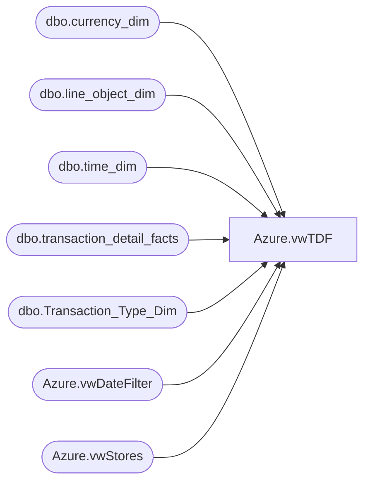

# Azure.vwTDF

**Database:** dw  
**Server:** papamart  

## Architecture Diagram



## Table Dependencies

| Referenced Table |
|---|
| dbo.currency_dim |
| dbo.line_object_dim |
| dbo.time_dim |
| dbo.transaction_detail_facts |
| dbo.Transaction_Type_Dim |
| Azure.vwDateFilter |
| Azure.vwStores |

## View Code

```sql
CREATE VIEW [Azure].[vwTDF]

AS
SELECT        tdf.product_key AS ProductKey, cd.currency_code AS CurrencyCode, '0' as TransactionID, tdf.transaction_line_seq AS TransactionLineSeq, tdf.Register_Num AS RegisterNumber, CONVERT(DATE, 
                         dd.actual_date) AS TransactionDate, 
						 CAST(CONVERT(VARCHAR, CONVERT(DATE, dd.actual_date)) + ' ' + LEFT(CONVERT(TIME, CONVERT(VARCHAR, td.hour) + ':' + CONVERT(VARCHAR, td.minute)), 5) 
                         + ':00.000' AS DATETIME) AS TransactionDateTime, ds.StoreID, tdf.unit_gross_amount AS UnitGrossAmount, tdf.units, tdf.unit_disc_amount AS UnitDiscAmount, ISNULL(tdf.party_y_n, 'N') AS PartyFlag, 
                         ttd.transaction_type AS TransactionType, lod.Line_Object_Description AS LineObject, Cast(tdf.transaction_no as varchar(20)) AS TransactionNumber, tdf.reference_no AS ReferenceNumber, tdf.vat_tax_amount AS VatTaxAmount, 
                         tdf.upsell_disc_allocated AS UpsellDiscAllocated, tdf.ext_cost AS ExtCost, tdf.line_action_key AS LineAction, ds.StoreKey
						 , Cast(tdf.transaction_id as varchar(20))  + Cast( ds.StoreKey AS varchar(10)) as TransactionKey
FROM            dbo.transaction_detail_facts AS tdf INNER JOIN
                         Azure.vwStores AS ds ON ds.StoreKey =  tdf.store_key LEFT OUTER JOIN
                         dbo.currency_dim AS cd ON cd.currency_key = tdf.currency_key LEFT OUTER JOIN
                         dbo.time_dim AS td ON td.time_key = tdf.time_key INNER JOIN
                         Azure.vwDateFilter AS dd ON tdf.date_key = dd.date_key LEFT OUTER JOIN
                         dbo.line_object_dim AS lod ON lod.Line_Object_Key = tdf.line_object_key LEFT OUTER JOIN
                         dbo.Transaction_Type_Dim AS ttd ON ttd.transaction_key = tdf.transaction_type_key
WHERE        (tdf.product_key >= 0)
```

