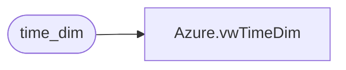

# Azure.vwTimeDim

**Database:** dw  
**Server:** papamart  

## Architecture Diagram



## Table Dependencies

| Referenced Table |
|---|
| time_dim |

## View Code

```sql
CREATE VIEW [Azure].[vwTimeDim]
AS
SELECT       time_key,[hour] hourOfDay,[minute] minuteOfHour, daypart, half_hour_id, qtr_hour_id  
FROM         time_dim
```

