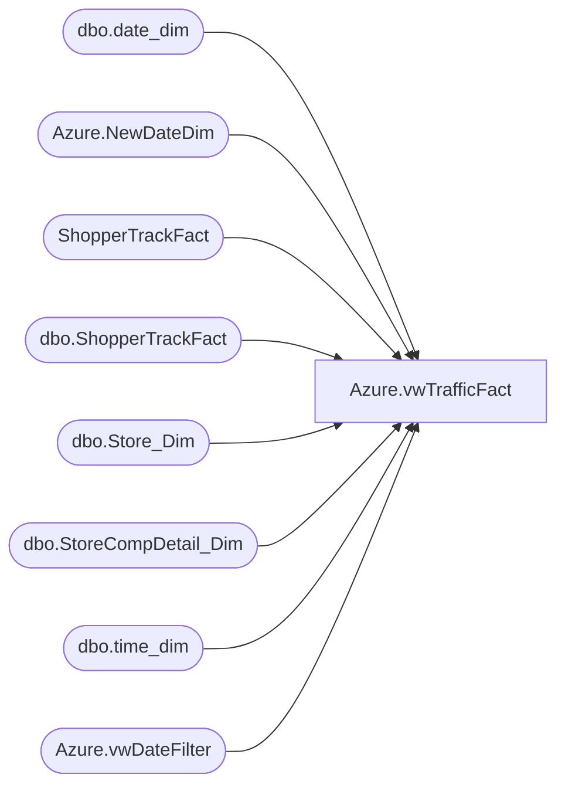

# Azure.vwTrafficFact

**Database:** dw  
**Server:** papamart  

## Architecture Diagram



## Table Dependencies

| Referenced Table |
|---|
| dbo.date_dim |
| Azure.NewDateDim |
| ShopperTrackFact |
| dbo.ShopperTrackFact |
| dbo.Store_Dim |
| dbo.StoreCompDetail_Dim |
| dbo.time_dim |
| Azure.vwDateFilter |

## View Code

```sql
CREATE VIEW [Azure].[vwTrafficFact] AS
-- =============================================================================================================
-- Name: [Azure].[vwTrafficFact]
--
-- Description: Traffic by store and hour.  
--
--
-- Dependencies: 
--
-- Revision History
--		Name:				Date:			Comments:
--		Tim Bytnar			4/11/2018		Initial creation
--		Tim Callahan		6/3/2020		Now referencing new Shopper Track table 
--      Ian Wallace			8/19/2020		fixed store key issue
-- =============================================================================================================
WITH HasDailyTraffic (StoreKey, DateKey, HasDailyTraffic) AS (
	SELECT 
		s.StoreKey,
		ndd.Date_Key,
		CASE WHEN SUM(s.EXITS) = 0 THEN 0
			ELSE 1
		END
	FROM ShopperTrackFact s
	INNER JOIN DW.dbo.date_dim d
		ON d.date_key=s.DateKey
	INNER JOIN DW.Azure.NewDateDim ndd
		ON d.actual_date = ndd.Date_Key
	WHERE
		(s.ENTERS <> 0
		OR s.EXITS <> 0)
		AND d.actual_date>=DATEADD(day, -7, DATEADD(year, -2, DATEADD(yy, DATEDIFF(yy, 0, GETDATE()), 0)))
	GROUP BY 
		s.StoreKey,
		ndd.Date_Key
	)
--SELECT  sd.store_id AS StoreKey,   -- idw 8/19/20
SELECT  sd.store_key AS StoreKey,
		CAST(dd.actual_date AS DATE) AS TrafficDate,
		td.hour AS TrafficHour,
	    SUM(sttf.EXITS) AS Traffic,
		h.HasDailyTraffic -- This field is used in "Traffic" transaction counts - when we only count transactions for stores that have traffic during that day.  Critical for conversion calcs.
FROM
	DW.dbo.ShopperTrackFact sttf 
	INNER JOIN Azure.vwDateFilter dd 
		ON dd.date_key = sttf.DateKey
	INNER JOIN DW.dbo.time_dim td 
		ON td.time_key = sttf.TimeKey
	LEFT JOIN DW.dbo.StoreCompDetail_Dim cmp 
		ON cmp.store_key = sttf.StoreKey AND cmp.date_key = sttf.DateKey
	INNER JOIN DW.dbo.Store_Dim sd
		ON sd.store_key=sttf.StoreKey
	INNER JOIN DW.Azure.NewDateDim ndd
		ON dd.actual_date = ndd.Date_Key
	INNER JOIN HasDailyTraffic h
		ON h.StoreKey=sttf.StoreKey
		AND h.DateKey=ndd.date_key
WHERE
	(sttf.ENTERS <> 0
	OR sttf.EXITS <> 0)
	
	GROUP BY sd.store_key, 
		 dd.actual_date,
		 td.hour,
		 h.HasDailyTraffic
```

